# cal-todo 와이어프레임

> 기준 문서: [도메인 정의서](1-domain-definition.md), [PRD](2-PRD.md), [사용자 시나리오](3-user-scenario.md). FR/BR/S/E ID는 기준 문서와 동일하다. 미정이던 항목은 [개발 계획 §5](8-plan.md)에서 확정되었다 (§7 참조).

## 1. 개요

- 플랫폼: 웹 우선. 데스크톱 기준 와이어프레임을 기본으로 하고, 모바일은 반응형 웹으로만 고려한다 (PRD §6, §8). 접근성은 고려하지 않는다.
- 표기: `[ ]` 버튼, `[____]` 입력창, `[v]` 드롭다운, `( )` 라디오/탭 선택, `[ ]` 체크박스 형태는 각 화면에서 별도 표기한다.
- 화면 배치·문구·버튼 위치는 와이어프레임 수준의 제안이며, 문서에 명시된 요구와 §7의 결정 사항이 확정 사항이다.

## 2. 화면 목록

| 화면 ID | 화면                                  | 관련 FR             | 관련 BR             | 관련 시나리오               |
| ------- | ------------------------------------- | ------------------- | ------------------- | --------------------------- |
| WF-01   | 회원가입                              | FR-01               | BR-01, BR-07        | S-01, E-01                  |
| WF-02   | 로그인                                | FR-01               | BR-01               | S-02, E-02                  |
| WF-03   | 내 정보 수정                          | FR-02               | BR-01               | S-03                        |
| WF-04   | 할일 조회 - 목록 탭 (필터, 삭제 포함) | FR-04~FR-07 | BR-02, BR-08, BR-12 | S-06, S-07, S-08, E-05~E-08, E-10 |
| WF-05   | 할일 조회 - 캘린더 탭                 | FR-06               | BR-02               | S-07, E-05                  |
| WF-06   | 할일 등록·수정                        | FR-03, FR-04        | BR-01~06            | S-04, S-05, E-03, E-04      |
| WF-07   | 카테고리 관리                         | FR-08               | BR-01, BR-03, BR-09~BR-11 | S-09, E-09, E-10            |

## 3. 화면 이동 흐름

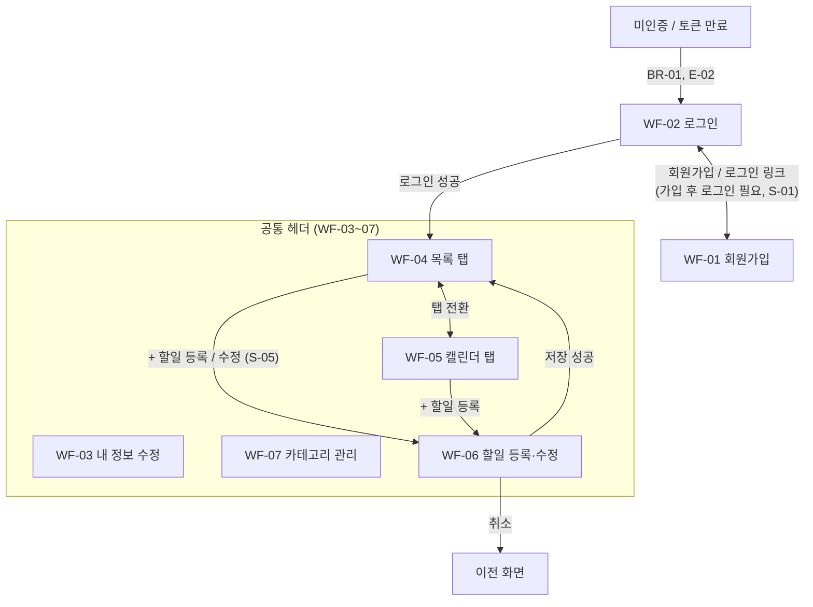

- 공통 헤더에서 할일(WF-04/05), 카테고리(WF-07), 내 정보(WF-03), 로그아웃으로 이동한다. 로그아웃은 클라이언트 토큰 삭제 후 WF-02로 이동한다.
- 테마 전환 버튼(다크 모드/라이트 모드)과 언어 선택(한국어/English)은 공통 헤더 오른쪽(로그아웃 왼쪽)과 WF-01·WF-02 폼 위에 [테마 전환][언어 선택] 순서로 둔다. 선택값은 새로고침 후에도 유지된다 (8-plan FE-15, FE-16). 와이어프레임 이미지에는 표시하지 않았다.
- 보호된 화면(WF-03~07)은 미인증 시 WF-02로 이동한다 (BR-01, E-02).

## 4. 화면 상세

### 4.1 WF-01 회원가입

- 관련: FR-01 / BR-01, BR-07 / S-01, E-01

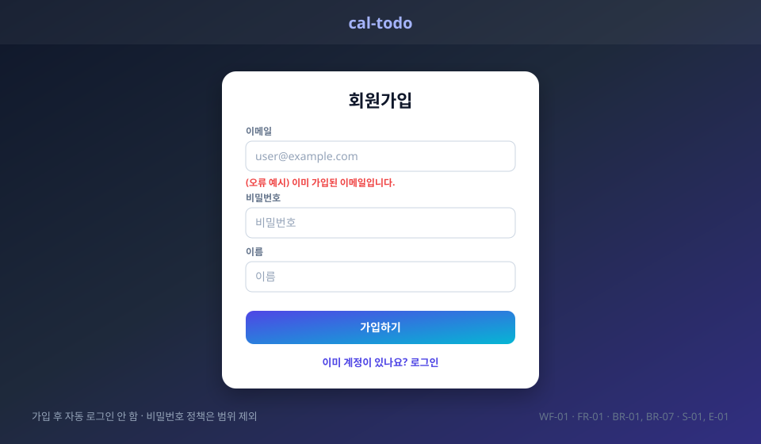

| 요소         | 설명                                                                                                   |
| ------------ | ------------------------------------------------------------------------------------------------------ |
| 입력         | 이메일(로그인 ID), 비밀번호, 이름 (도메인 §3 사용자)                                                   |
| 가입하기     | 계정 생성. 가입 후 앱 사용은 로그인해야 가능(BR-01) -> WF-02로 이동 (자동 로그인 안 함) |
| 오류 (BR-07) | 이미 가입된 이메일(대소문자 구분 없음)이면 가입되지 않고 이메일 입력창 아래에 오류 안내 (E-01)                             |
| 비밀번호     | 정책(길이·복잡도 등)은 범위 제외                                                                       |

### 4.2 WF-02 로그인

- 관련: FR-01 / BR-01 / S-02, E-02

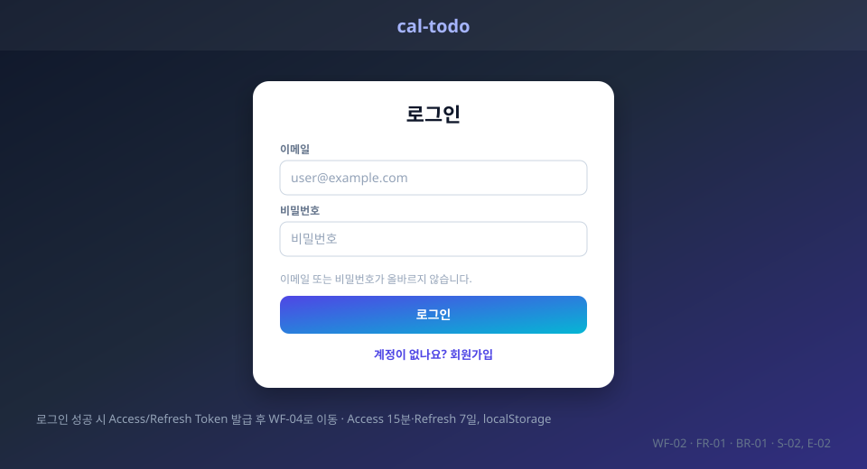

| 요소                | 설명                                                                                          |
| ------------------- | --------------------------------------------------------------------------------------------- |
| 로그인              | 성공 시 Access/Refresh Token 발급 후 WF-04로 이동. Access 15분·Refresh 7일, localStorage 저장 |
| 미인증 접근 (BR-01) | 로그인하지 않았거나 Refresh Token이 만료/무효이면 보호된 화면 접근 시 이 화면으로 이동 (E-02) |
| 로그인 실패         | 이메일·비밀번호 구분 없이 "이메일 또는 비밀번호가 올바르지 않습니다." 표시 (E-02)             |

### 4.3 WF-03 내 정보 수정

- 관련: FR-02 / BR-01 / S-03

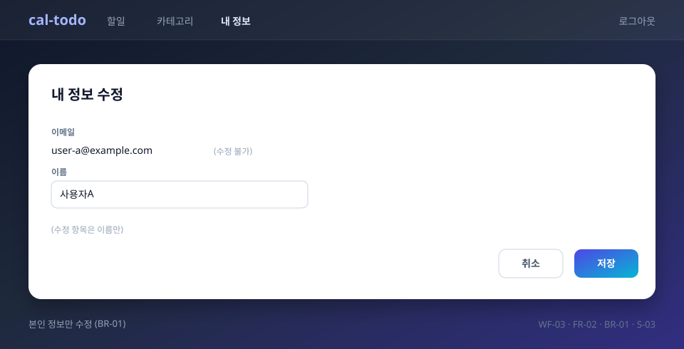

| 요소 | 설명                                                                                   |
| ---- | -------------------------------------------------------------------------------------- |
| 이름 | 표시 이름 수정. 수정 가능한 항목은 이름만이며 이메일·비밀번호는 변경 불가 (S-03)     |
| 저장 | 수정 내용을 저장·반영. 본인 정보만 수정 (BR-01)                                        |

### 4.4 WF-04 할일 조회 - 목록 탭 (필터, 삭제 포함)

- 관련: FR-04~FR-07 / BR-02, BR-08, BR-12 / S-06, S-07, S-08, E-05~E-08, E-10

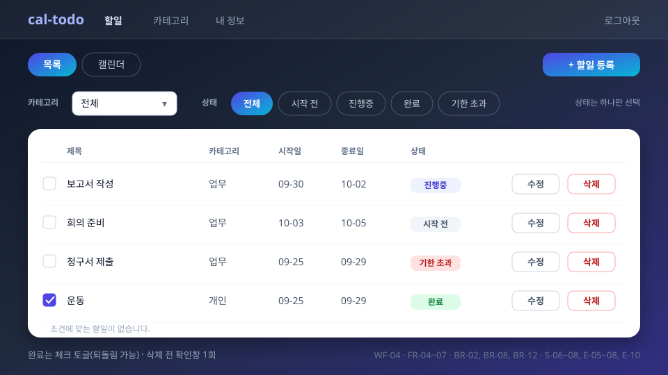

| 요소                     | 설명                                                                                                          |
| ------------------------ | ------------------------------------------------------------------------------------------------------------- |
| 탭 (FR-06)               | 목록 / 캘린더 전환. 캘린더 선택 시 WF-05                                                                      |
| 카테고리 필터 (FR-07)    | 본인 카테고리(기본 포함) 중 선택 또는 전체                                                                    |
| 상태 필터 (FR-07)        | 시작 전 / 진행중 / 완료 / 기한 초과 중 하나만 선택. 다시 선택하면 기존 선택을 대체(E-08). 카테고리와 AND 적용 |
| 상태 표시                | 저장하지 않고 완료 -> 기한 초과 -> 시작 전 -> 진행중 순으로 판단, 오늘은 KST 기준 (BR-08, E-06)               |
| 기한 초과 (E-07)         | 종료일자가 지났고 완료되지 않은 할일만 표시. 완료된 할일 제외                                                 |
| 완료 체크                | 목록의 체크박스로 완료 여부를 토글하며 되돌릴 수 있음 (BR-12, E-06)                                           |
| 수정                     | WF-06(수정 모드)로 이동 (S-05)                                                                                |
| 삭제 (FR-05)             | 삭제 요청 시 확인창 1회 후 삭제되고 조회 화면에서 사라짐 (S-06, E-10)                                        |
| 본인 할일만 표시 (BR-02) | 타인 할일은 목록에 나타나지 않으며, 타인 할일 조회·수정·삭제 요청은 거부되고 데이터 변경 없음 (E-05)          |
| 빈 결과                  | 조건에 맞는 할일이 없으면 "조건에 맞는 할일이 없습니다." 표시 (E-08)                                          |

### 4.5 WF-05 할일 조회 - 캘린더 탭

- 관련: FR-06 / BR-02 / S-07, E-05

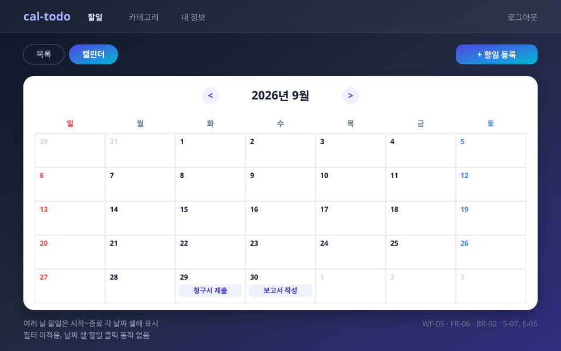

스타일 가이드([9-style-guide.md](9-style-guide.md)) 적용안 (공통 테스트 데이터 TODO-A1~A6, D = 2026-10-01 기준):

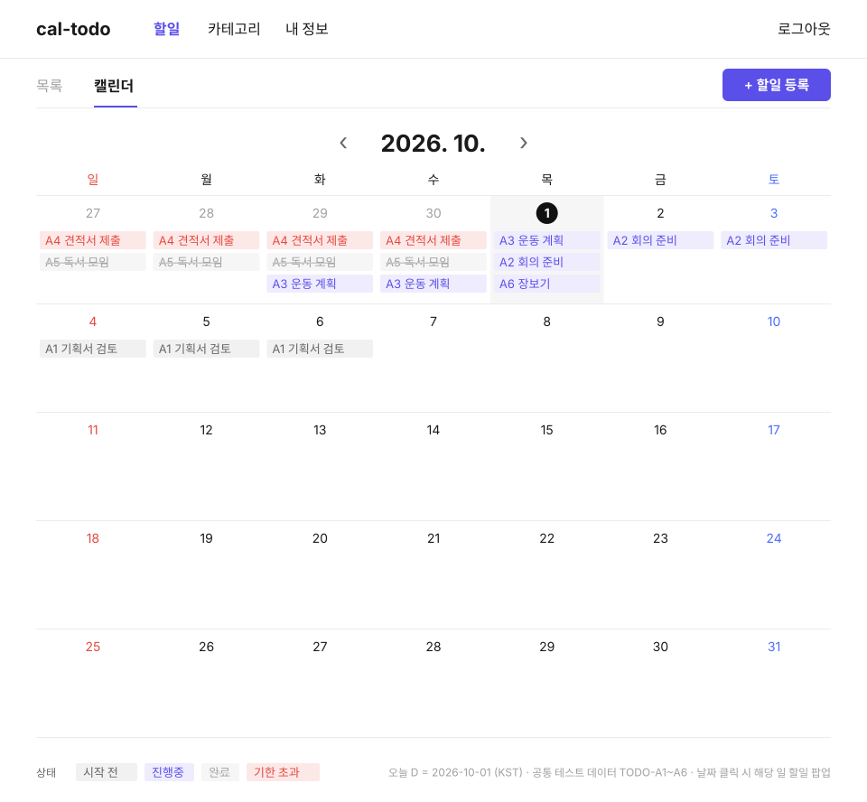

| 요소      | 설명                                                                                                            |
| --------- | --------------------------------------------------------------------------------------------------------------- |
| 월 이동   | 이전/다음 달 이동으로 월별 캘린더 조회                                                                          |
| 할일 표시 | 본인 할일만 표시 (BR-02). 시작일·종료일 기준. 여러 날에 걸친 할일은 시작~종료 각 날짜 셀에 제목 표시 |
| 필터      | 필터는 목록 뷰 기능(FR-07)이며 캘린더 탭에는 적용하지 않음                                                      |
| 할일 선택 | 할일·날짜 셀 클릭 동작 없음                                                                                     |

### 4.6 WF-06 할일 등록·수정

- 관련: FR-03, FR-04 / BR-01~BR-06 / S-04, S-05, E-03, E-04
- 등록과 수정은 같은 화면을 사용한다. 수정 시에는 기존 값이 채워지고 타이틀이 "할일 수정"이 된다. 날짜 검증은 등록과 동일(FR-04).

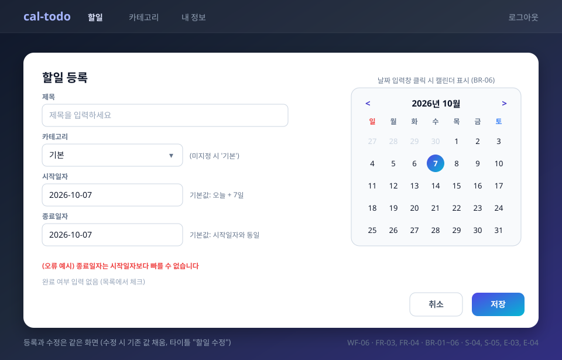

| 요소              | 설명                                                                                                            |
| ----------------- | --------------------------------------------------------------------------------------------------------------- |
| 제목              | 할일 내용 입력                                                                                                  |
| 카테고리          | 본인 카테고리 선택. 선택하지 않으면 '기본'으로 저장 (BR-03, E-04)                                               |
| 시작일자          | 캘린더로 선택 (BR-06). 등록 시 기본값은 오늘 + 7일이며 변경 가능 (BR-05, S-04)                                  |
| 종료일자          | 캘린더로 선택 (BR-06). 등록 시 기본값은 시작일자와 동일 (BR-05). 시작일자 변경 시 종료일자는 자동 조정하지 않음 (위반 시 BR-04 오류) |
| 오류 (BR-04)      | 종료일자가 시작일자보다 빠르면 저장 불가, 오류 안내. 같은 날은 허용 (E-03)                                      |
| 저장              | 성공 시 WF-04로 이동 (등록 시 완료 여부는 false, S-04)                                                          |
| 취소              | 저장하지 않고 이전 화면으로 이동                                                                                |
| 완료 처리         | 이 화면에는 완료 입력을 두지 않음. 완료 여부는 목록 체크 토글로 변경 (BR-12, S-05, E-06)                        |
| 접근 제한 (BR-02) | 타인 할일의 수정 화면 접근/저장 요청은 거부되고 데이터 변경 없음 (E-05)                                         |

### 4.7 WF-07 카테고리 관리

- 관련: FR-08 / BR-01, BR-03, BR-09~BR-11 / S-09, E-09, E-10

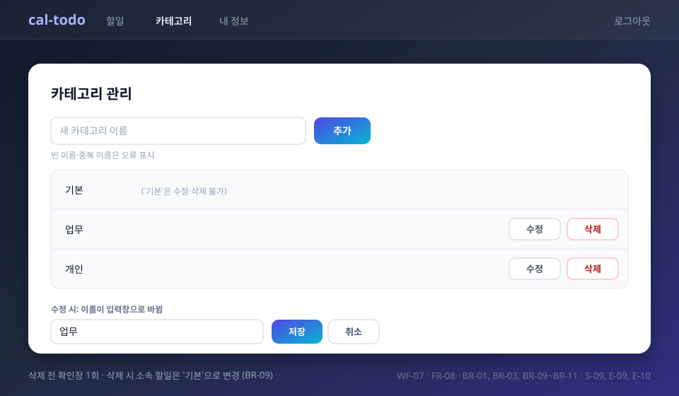

| 요소              | 설명                                                                                          |
| ----------------- | --------------------------------------------------------------------------------------------- |
| 추가 (생성)       | 이름 입력 후 본인 카테고리 생성. 카테고리는 사용자별 관리                                     |
| 수정              | 본인 카테고리 이름 수정                                                                       |
| 삭제 (BR-09)      | 삭제 전 확인창 1회. 삭제 시 소속 할일은 삭제되지 않고 '기본' 카테고리로 변경 (E-09)           |
| '기본' 카테고리   | 수정·삭제 불가 (BR-10, E-10). '기본' 행에는 수정·삭제 버튼을 표시하지 않음                    |
| 이름 중복·빈 이름 | 빈 이름과 사용자별 중복 이름은 오류 안내 후 저장하지 않음 (BR-11, E-10)                       |

## 5. 반응형 메모

- 데스크톱 기준으로 작성. 모바일은 별도 UI가 아닌 반응형 웹 배치 변경으로만 고려한다 (PRD §3, §8).
- 공통 헤더: 좁은 화면에서 메뉴를 접지 않고 줄바꿈으로 배치한다.
- 폼 화면(WF-01~03, 06, 07): 입력창이 화면 너비를 채우는 1열 배치.
- 아래는 핵심 화면 2개의 모바일 배치안이다.

### 5.1 WF-04 모바일 (목록 탭)

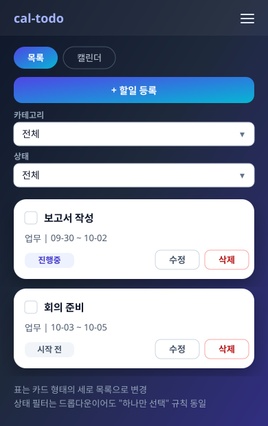

- 표는 카드 형태의 세로 목록으로 변경. 상태 필터는 드롭다운으로 표시해도 "하나만 선택" 규칙은 동일하다.

### 5.2 WF-06 모바일 (할일 등록·수정)

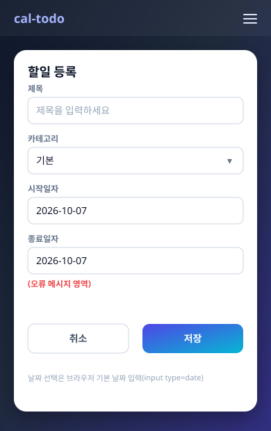

- 날짜 선택은 브라우저 기본 날짜 입력(`<input type="date">`)을 사용한다.

## 6. FR 커버리지

| FR    | 화면                                |
| ----- | ----------------------------------- |
| FR-01 | WF-01, WF-02                        |
| FR-02 | WF-03                               |
| FR-03 | WF-06                               |
| FR-04 | WF-06 (진입: WF-04), WF-04 (완료 체크) |
| FR-05 | WF-04                               |
| FR-06 | WF-04, WF-05                        |
| FR-07 | WF-04                               |
| FR-08 | WF-07 (카테고리 선택: WF-04, WF-06) |

## 7. 결정 사항

도메인 정의서 §7, PRD §9, 시나리오 §6 중 화면에 영향을 주는 항목이며, [개발 계획 §5](8-plan.md)에서 모두 확정되었다. 남은 미결 사항은 없다.

| 항목                                              | 결정                                                    | 관련 화면    |
| ------------------------------------------------- | ------------------------------------------------------- | ------------ |
| 완료 처리 방식·되돌림                             | 목록 체크박스 토글, 되돌림 가능 (BR-12). 편집 화면에 완료 입력 없음 | WF-04, WF-06 |
| 여러 날에 걸친 할일의 캘린더 표시 방식            | 시작~종료 각 날짜 셀에 표시                             | WF-05        |
| 삭제 시 확인 절차 (할일·카테고리)                 | 확인창 1회                                              | WF-04, WF-07 |
| '기본' 카테고리의 수정·삭제 가능 여부             | 불가 (BR-10). 수정·삭제 버튼 숨김                       | WF-07        |
| 조건에 맞는 할일이 없을 때 표시                   | "조건에 맞는 할일이 없습니다."                          | WF-04        |
| 캘린더 탭의 필터 적용, 할일·날짜 클릭 동작        | 필터 미적용, 클릭 동작 없음                             | WF-05        |
| 수정 가능한 내 정보 항목 범위                     | 이름만                                                  | WF-03        |
| 가입 직후 자동 로그인 여부                        | 자동 로그인 안 함 (WF-02로 이동)                        | WF-01        |
| 로그인 실패 안내 문구                             | "이메일 또는 비밀번호가 올바르지 않습니다." (구분 없음) | WF-02        |
| 시작일자 변경 시 종료일자 자동 조정 여부          | 하지 않음 (초기값만 BR-05 적용)                         | WF-06        |
| 카테고리 이름 검증(중복·빈 값)                    | 빈 값 불가, 사용자별 유일 (BR-11)                       | WF-07        |
| 모바일 헤더 메뉴 방식                             | 줄바꿈 배치 (접지 않음)                                 | 공통         |
| 날짜 선택 방식                                    | `<input type="date">`                                   | WF-06        |
| 언어 선택 위치·유지                               | 공통 헤더, WF-01·WF-02 폼 위. localStorage 유지         | 공통, WF-01·02 |
| 테마 전환 위치·초기값                             | 언어 선택 왼쪽. 초기값 OS 설정, localStorage 유지       | 공통, WF-01·02 |
| 토큰 만료 시간, 토큰 저장 위치                    | Access 15분, Refresh 7일, localStorage                  | WF-02        |
| 카테고리 소유 범위                                | 사용자별                                                | WF-07        |
| 상태 판단 시간대                                  | KST                                                     | WF-04        |
| 필터 조합 방식                                    | 카테고리 + 상태 1개 AND                                 | WF-04        |

## 8. 문서 변경 이력

| 버전 | 변경일     | 변경자                  | 변경내용  |
| ---- | ---------- | ----------------------- | --------- |
| 1.0  | 2026-09-30 | leejs05031119@gmail.com | 최초 작성 |
| 1.1 | 2026-09-30 | leejs05031119@gmail.com | 화면 이동 흐름을 표로 변경(미리보기 표시 문제 수정), 첫 줄 들여쓰기 제거 |
| 1.2 | 2026-09-30 | leejs05031119@gmail.com | 화면 이동 흐름을 mermaid 그래프로 변경 |
| 1.3 | 2026-09-30 | leejs05031119@gmail.com | §4.5 WF-05 와이어프레임을 SVG 이미지(images/wf-05-calendar.svg)로 변경 |
| 1.4 | 2026-09-30 | leejs05031119@gmail.com | 나머지 화면 와이어프레임(WF-01~04, 06, 07, 모바일 2종)을 SVG 이미지로 변경 |
| 1.5 | 2026-09-30 | leejs05031119@gmail.com | 미정 항목 결정 반영 (§7 미결 사항 → 결정 사항, 화면 설명·SVG의 "(미정)" 문구 확정 표현으로 변경) |
| 1.6 | 2026-09-30 | leejs05031119@gmail.com | 문서 정합성 점검: WF-04 관련 ID에 FR-04·BR-12·E-10 추가(완료 체크·삭제 확인), §4.7 WF-07 관련 BR을 화면 목록과 일치(BR-09~BR-11), FR-04 커버리지에 WF-04 완료 체크 추가, SVG 문구 수정(WF-03 이메일 "수정 불가", WF-04·WF-07 관련 ID) |
| 1.7 | 2026-10-01 | leejs05031119@gmail.com | §4.5에 스타일 가이드 적용 이미지(images/wf-05-calendar-styled.svg) 추가 |
| 1.8 | 2026-10-01 | leejs05031119@gmail.com | 언어 선택(한국어/English) 위치를 §3 화면 흐름과 결정 사항 표에 추가 (8-plan FE-15) |
| 1.9 | 2026-10-01 | leejs05031119@gmail.com | 테마 전환 버튼(다크/라이트) 위치를 §3 화면 흐름과 결정 사항 표에 추가 (8-plan FE-16) |
