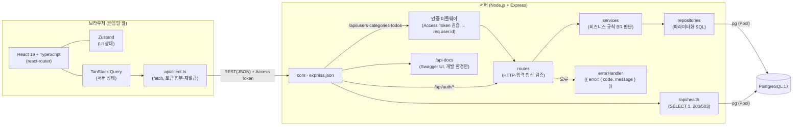
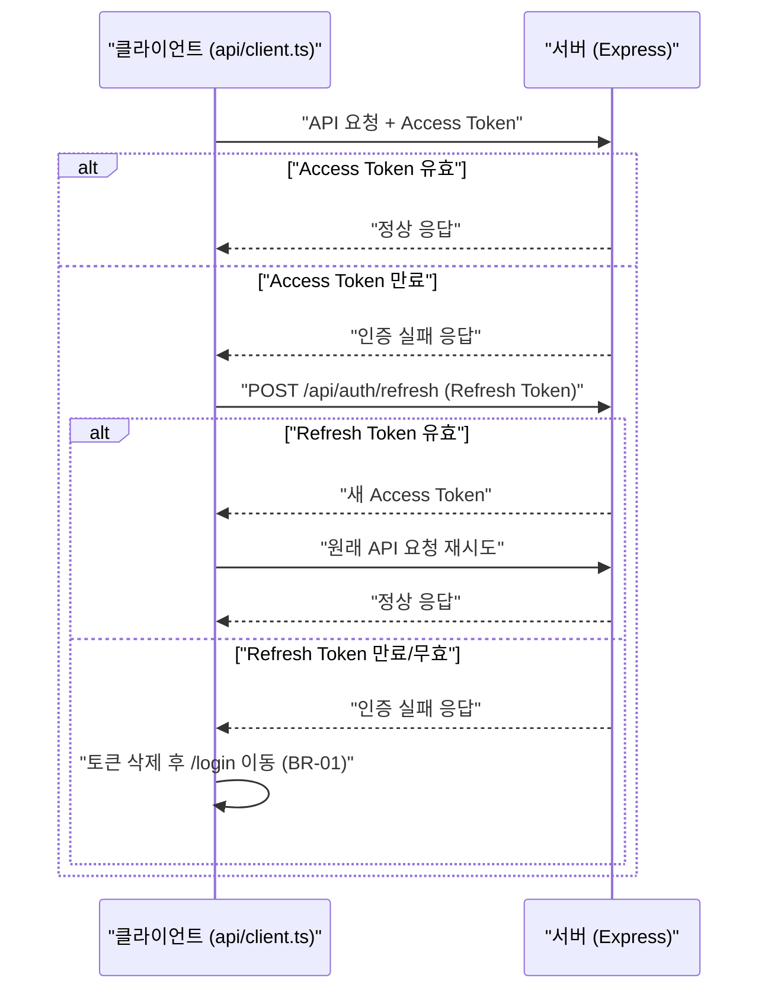
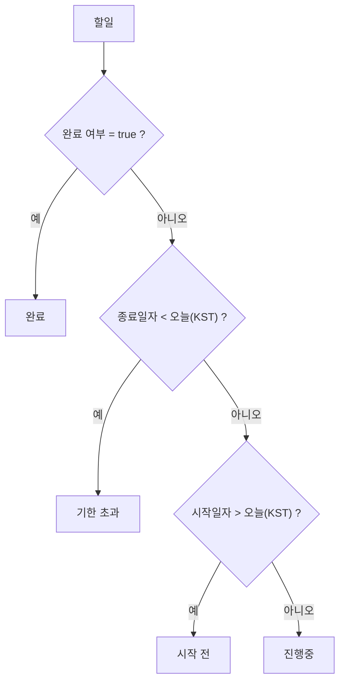

# cal-todo 기술 아키텍처 다이어그램

> 기준 문서: [PRD §6](2-PRD.md), [프로젝트 구조 설계 원칙](5-project-principle.md), [도메인 정의서](1-domain-definition.md). 문서에 없는 구성요소는 넣지 않았고, 미정 항목은 8-plan §5에서 확정했다(§4).

## 1. 전체 기술 아키텍처

브라우저(React) → Express(routes → services → repositories) → pg → PostgreSQL 17 순으로 요청이 흐른다. 인증 미들웨어는 routes 앞단에서 Access Token을 검증한다(공개 API는 `/api/auth/*`와 헬스 체크 `/api/health`뿐). `/api/health`는 DB에 `SELECT 1`을 보내 연결 상태를 200/503으로 응답한다. 개발 환경에서는 `backend/swagger.yaml`을 `/api-docs` Swagger UI로 함께 제공한다(`NODE_ENV=production`이면 미등록, 5-project-principle §5.6).

### 1.1 기술 스택

| 구분 | 라이브러리 | 버전(package.json) |
|---|---|---|
| 프론트 | react, react-dom | ^19.3.0 |
| 프론트 | react-router | ^8.4.0 |
| 프론트 | @tanstack/react-query | ^5.104.0 |
| 프론트 | zustand (`persist`로 언어·테마 유지) | ^5.0.15 |
| 프론트 빌드 | vite, typescript | ^8.3.1, ^7.0.2 |
| 프론트 테스트 | vitest, jsdom, @testing-library/react, @testing-library/dom | ^5.0.3, ^30.1.1, ^16.3.3, ^10.4.2 |
| 백엔드 | express | ^5.2.1 |
| 백엔드 | pg | ^8.23.0 |
| 백엔드 | jsonwebtoken, bcrypt, cors | ^9.0.3, ^6.0.0, ^2.8.6 |
| API 문서 | Swagger UI (CDN `swagger-ui-dist@5`) | - |
| DB | PostgreSQL | 17 |
| 런타임 | Node.js (`engines` 미지정. `--env-file`·`--watch`·`--test-coverage-include` 사용으로 22 이상 필요) | - |
| E2E | Playwright MCP (수동 실행, `test/e2e`) | - |

## 2. JWT Access/Refresh Token 재발급 흐름

Access Token 만료 시 Refresh Token으로 재발급하고, 그것도 무효면 로그인 화면으로 보내는 분기가 있어 순서도로 풀었다. (FR-01, BR-01, 시나리오 E-02)

Access Token 15분, Refresh Token 7일이며 둘 다 클라이언트 `localStorage`에 저장한다. 서버는 Refresh Token을 저장·폐기하지 않는 무상태이고, 로그아웃은 클라이언트 토큰 삭제다. (8-plan §5)

클라이언트는 `/api/auth/*` 외 요청이 401이면 재발급을 1회 시도한다. 재발급 응답에는 새 Access Token만 있고 Refresh Token은 갱신하지 않는다. 재발급에 실패하면 토큰을 지우고 `/login`으로 이동한다.

## 3. 할일 상태 판단 순서

상태는 저장하지 않고 서버가 위에서 아래 순서로 계산하며, 먼저 일치하는 상태를 적용한다. 순서가 바뀌면 결과가 달라지고 필터(SQL)와도 일치해야 해서 추가했다. (FR-06, FR-07, BR-08, 도메인 §3 '할일 상태')

상태 판단용 '오늘'은 KST 기준이며 서버에서만 산출한다. 프론트는 표시·입력 기본값(BR-05 초기 날짜, 캘린더 초기 월·오늘 강조)에만 KST 날짜를 계산한다.

## 4. 결정 사항

8-plan §5에서 확정한 항목이다.

| 항목 | 결정 |
|---|---|
| 토큰 만료 시간, 토큰 저장 위치 | Access 15분, Refresh 7일. 둘 다 `localStorage` |
| Refresh Token 서버 저장·폐기 방식, 로그아웃 동작 | 서버 무상태(저장·폐기 없음). 로그아웃은 클라이언트 토큰 삭제 |
| pg 풀 크기·타임아웃·서버 인스턴스 수 | `DB_POOL_MAX=20`, 타임아웃 pg 기본값, 인스턴스 1개 |
| 동시접속 1000명 검증 방법, 그 외 성능 기준 | 비즈니스 목표로만 유지, 부하 테스트 없음. 성능 기준은 이번 범위 외 |
| 배포 환경, 로깅·모니터링 | 이번 범위 외 |
| 타인 리소스 접근 거부 시 HTTP 상태 코드 | 404 |
| 캘린더 탭 조회 API | 전용 API 없이 필터 없는 `GET /api/todos` |
| API 문서 | `/api-docs` Swagger UI(CDN 로드), 개발 환경만 |
| 프론트 빌드 도구·라우터 라이브러리 | Vite, react-router |
| 다국어·다크 모드 | 라이브러리 없이 프론트에서만 처리(`i18n.ts` 사전, `<html data-theme>` + CSS 토큰 재정의). 백엔드 변경 없음 |
| 저장소 내 `frontend/`·`backend/`와 기존 `team-caltalk/` 폴더의 관계 | 루트에 새로 만들고 `team-caltalk/`는 수정하지 않음 |

## 5. 변경 이력

| 버전 | 변경일 | 변경자 | 변경내용 |
|---|---|---|---|
| 1.0 | 2026-09-30 | leejs05031119@gmail.com | 최초 작성 |
| 1.1 | 2026-09-30 | leejs05031119@gmail.com | ERD(데이터 모델) 추가 |
| 1.2 | 2026-09-30 | leejs05031119@gmail.com | ERD 삭제 (별도 문서로 작성 예정) |
| 1.3 | 2026-09-30 | leejs05031119@gmail.com | 8-plan §5 미정 항목 결정 반영 |
| 1.4 | 2026-10-01 | leejs05031119@gmail.com | Swagger UI(`/api-docs`, 개발 환경만) 반영 |
| 1.5 | 2026-10-02 | leejs05031119@gmail.com | 구현 반영: §1 다이어그램에 api/client.ts·cors/json·errorHandler·`/api/auth/*` 인증 제외 경로 추가, §1.1 기술 스택 표 추가, §2 재발급 조건·Refresh Token 미갱신·실패 처리, §3 프론트 KST 표시 예외, §4 다국어·다크 모드 |
| 1.6 | 2026-10-02 | leejs05031119@gmail.com | 헬스 체크 `/api/health`(인증 없음, DB 연결 확인)를 §1 설명·다이어그램에 추가 |
