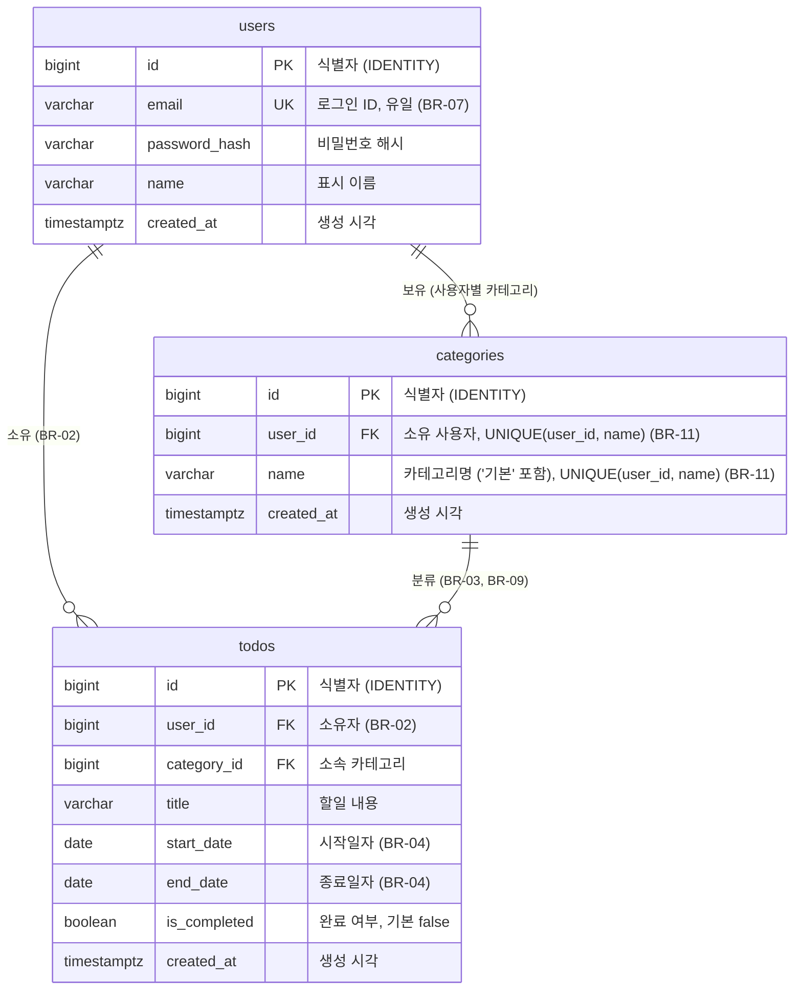

# cal-todo ERD

> 기준 문서: [도메인 정의서](1-domain-definition.md) §3~4, [PRD](2-PRD.md) §6, [프로젝트 구조 설계 원칙](5-project-principle.md) §3, [사용자 시나리오](3-user-scenario.md) §3. FR/BR ID는 기준 문서와 동일하다. 문서에 없는 테이블·컬럼은 만들지 않았고, 미정·제안 항목은 [8-plan](8-plan.md) §5에서 확정했다(§6).

## 1. ERD 다이어그램

DB는 PostgreSQL 17, 접근은 `pg`(ORM 미사용)이다. 엔티티는 도메인 정의서 §3의 사용자·카테고리·할일 3개뿐이다. 할일 상태는 저장하지 않으므로 컬럼이 없다(원칙 1-4).



## 2. 테이블 정의

네이밍은 5-project-principle.md §3을 따른다(테이블 snake_case 복수형, PK `id`, FK `<단수 테이블>_id`). 타입은 PostgreSQL 기준이며 8-plan §5 'DB 세부' 결정으로 확정했다. 식별자는 `BIGINT GENERATED ALWAYS AS IDENTITY`다.

### 2.1 users (사용자)

| 컬럼 | 타입 | 제약 | 설명 |
|---|---|---|---|
| id | BIGINT IDENTITY | PK | 사용자 고유 ID |
| email | VARCHAR(255) | NOT NULL, UNIQUE | 로그인 ID. 유일(BR-07). 서비스가 앞뒤 공백 제거·소문자 정규화 후 저장·조회하고 DB는 단순 UNIQUE |
| password_hash | VARCHAR(255) | NOT NULL | 단방향 해시(솔트 포함)만 저장. 평문 금지(원칙 5.3) |
| name | VARCHAR(100) | NOT NULL | 표시 이름 |
| created_at | TIMESTAMPTZ | NOT NULL, DEFAULT now() | 생성 시각 |

### 2.2 categories (카테고리)

| 컬럼 | 타입 | 제약 | 설명 |
|---|---|---|---|
| id | BIGINT IDENTITY | PK | 카테고리 고유 ID |
| user_id | BIGINT | NOT NULL, FK → users.id | 소유 사용자. 카테고리는 사용자별(확정) |
| name | VARCHAR(100) | NOT NULL | 카테고리명. 빈 값 400, 사용자별 중복 409(BR-11) |
| created_at | TIMESTAMPTZ | NOT NULL, DEFAULT now() | 생성 시각 |

- 테이블 제약: `CONSTRAINT categories_user_name_unique UNIQUE (user_id, name)` (BR-11).
- '기본' 카테고리(BR-10): 가입 트랜잭션에서 사용자별 행으로 생성하고 이름 '기본'으로 식별한다. 서비스가 수정·삭제 요청을 400 `DEFAULT_CATEGORY_PROTECTED`로 거부한다. DDL에는 시드하지 않는다.

### 2.3 todos (할일)

| 컬럼 | 타입 | 제약 | 설명 |
|---|---|---|---|
| id | BIGINT IDENTITY | PK | 할일 고유 ID |
| user_id | BIGINT | NOT NULL, FK → users.id | 소유자(BR-02). 조회·수정·삭제 SQL은 `WHERE id = $1 AND user_id = $2`(원칙 5.4) |
| category_id | BIGINT | NOT NULL, FK → categories.id | 소속 카테고리. 미지정 시 서비스가 '기본' 카테고리 id를 채운다(BR-03). '기본'이 사용자별 행으로 항상 존재하므로 NOT NULL |
| title | VARCHAR(200) | NOT NULL | 할일 내용 |
| start_date | DATE | NOT NULL | 시작일자. 시각 없는 DATE(원칙 1-7) |
| end_date | DATE | NOT NULL | 종료일자. 시각 없는 DATE(원칙 1-7) |
| is_completed | BOOLEAN | NOT NULL, DEFAULT false | 완료 여부. 등록 시 false(S-04). 목록 체크박스로 토글하며 되돌릴 수 있다(BR-12) |
| created_at | TIMESTAMPTZ | NOT NULL, DEFAULT now() | 생성 시각 |

- 테이블 제약: `CHECK (start_date <= end_date)` (BR-04, 같은 날 허용).
- 상태(시작 전/진행중/완료/기한 초과)는 컬럼으로 두지 않고 `start_date`, `end_date`, `is_completed`와 KST 오늘로 서버가 계산한다(도메인 §3, BR-08).
- BR-05(시작일 기본값 +7일, 종료일=시작일)는 입력 기본값이므로 DB DEFAULT로 두지 않는다.

## 3. 관계·삭제 정책

| 관계 | 카디널리티 | FK | 삭제 정책 |
|---|---|---|---|
| users – categories | 1 : N | categories.user_id → users.id | 사용자 삭제(탈퇴) 기능 없음. `NO ACTION` |
| users – todos | 1 : N | todos.user_id → users.id | 위와 동일 |
| categories – todos | 1 : N | todos.category_id → categories.id | `ON DELETE RESTRICT`. 소속 할일이 남은 카테고리는 DB가 삭제를 거부 |

### BR-09 (카테고리 삭제 시 소속 할일을 '기본'으로 이동)

DB 트리거나 `ON DELETE SET DEFAULT`는 쓰지 않고, 서비스 트랜잭션 한 개로 처리한다(원칙 2.1, `categoryService`).

```sql
BEGIN;
-- 1) 소속 할일을 해당 사용자의 '기본' 카테고리로 이동 (할일은 삭제하지 않음)
UPDATE todos SET category_id = $default_id
 WHERE category_id = $1 AND user_id = $2;
-- 2) 카테고리 삭제 (본인 소유 조건 포함)
DELETE FROM categories WHERE id = $1 AND user_id = $2;
COMMIT;
```

- 이유: FK를 `RESTRICT`로 두면 서비스가 UPDATE를 빠뜨렸을 때 DELETE가 실패해 할일이 삭제되거나 미분류로 남는 사고를 막는다. `CASCADE`는 BR-09(할일 삭제 금지)를 위반하므로 쓰지 않는다.
- `$default_id`는 같은 사용자의 '기본' 카테고리 id다. 이름 '기본'으로 식별하며 코드에서는 `DEFAULT_CATEGORY_NAME` 상수 한 곳만 참조한다(원칙 §3).
- 삭제 대상이 '기본' 자신이면 BR-10에 따라 서비스가 400 `DEFAULT_CATEGORY_PROTECTED`로 거부한다(트랜잭션 시작 전, E-10).
- 카테고리 소유 일치(`todos.user_id` = `categories.user_id`)는 DB 제약이 아니라 서비스에서 검증한다(원칙 5.4). 복합 FK 등은 규모 대비 과하다고 보아 도입하지 않는다.

## 4. 인덱스·제약 목록

| 대상 | 종류 | 근거 |
|---|---|---|
| users.id, categories.id, todos.id | PK | 원칙 §3 |
| users.email | UNIQUE | BR-07 (UNIQUE가 인덱스를 자동 생성. 소문자 정규화는 서비스) |
| categories(user_id, name) | UNIQUE (`categories_user_name_unique`) | BR-11 (UNIQUE가 인덱스를 자동 생성. `user_id` 선두 컬럼이라 본인 카테고리 목록 조회(FR-08)도 커버) |
| todos.user_id | 인덱스 | 원칙 §3 (내 할일 조회·필터의 기본 조건, BR-02) |
| todos.start_date <= end_date | CHECK | BR-04 |
| todos.user_id → users.id | FK | 소유자(BR-02) |
| todos.category_id → categories.id | FK (ON DELETE RESTRICT) | BR-09 |
| categories.user_id → users.id | FK | 카테고리 사용자별 소유 |
| todos.category_id | 인덱스 | 카테고리 필터(FR-07)와 BR-09의 UPDATE 조건 |
| NOT NULL / DEFAULT | 제약 | §2 각 표 참조 (`is_completed` 기본 false) |

`categories.user_id` 단독 인덱스(`idx_categories_user_id`)는 `categories_user_name_unique`의 인덱스와 중복이므로 두지 않는다. 그 외 컬럼(날짜·복합) 인덱스는 성능 기준이 이번 범위 외(PRD §5)이므로 추가하지 않는다. 인덱스는 `idx_todos_user_id`, `idx_todos_category_id` 2개다.

## 5. 도메인 개념 ↔ 테이블 매핑

| 도메인 개념 | 테이블·컬럼 | 관련 ID |
|---|---|---|
| 사용자(식별자·이메일·비밀번호·이름) | users(id, email, password_hash, name) | FR-01, FR-02 |
| 이메일 유일(대소문자 구분 없음) | users.email UNIQUE + 서비스 소문자 정규화 | BR-07 |
| 인증 필수 | DB 대상 아님 (JWT 미들웨어) | BR-01 |
| 카테고리(식별자·이름) | categories(id, name) | FR-08 |
| 카테고리 사용자별 소유 | categories.user_id | FR-08 |
| 카테고리 이름 빈 값 400·중복 409 | categories UNIQUE (user_id, name) + 서비스 검증 | BR-11 |
| '기본' 카테고리 수정·삭제 불가 | 사용자별 행(이름 '기본', 가입 트랜잭션에서 생성). 서비스가 400 거부 | BR-10 |
| 완료 처리 토글·되돌림 | todos.is_completed (서비스에서 갱신) | BR-12 |
| 할일 소유자 | todos.user_id | BR-02 |
| 할일 카테고리, 미지정 시 '기본' | todos.category_id (서비스가 '기본' id 채움) | BR-03, FR-03 |
| 제목·시작일자·종료일자·완료 여부 | todos(title, start_date, end_date, is_completed) | FR-03, FR-04 |
| 종료일자 ≥ 시작일자 | CHECK (start_date <= end_date) | BR-04 |
| 시작일 기본값 +7일, 종료일=시작일 | DB 대상 아님 (프론트 폼 초기값, 서버측 처리) | BR-05 |
| 캘린더 날짜 선택 | DB 대상 아님 (UI). DATE 타입으로 저장 | BR-06 |
| 할일 상태(시작 전/진행중/완료/기한 초과) | 저장하지 않음. 컬럼 없음 | BR-08, FR-06, FR-07 |
| 카테고리 삭제 시 할일 '기본'으로 이동 | 서비스 트랜잭션 UPDATE 후 DELETE (§3) | BR-09, FR-08 |
| 목록·캘린더 조회, 필터 | todos.user_id 조건 + 날짜·완료 여부 WHERE | FR-06, FR-07 |

## 6. 결정 사항

8-plan §5에서 확정한 항목이다.

| 항목 | 결정 |
|---|---|
| 식별자 타입 | `BIGINT GENERATED ALWAYS AS IDENTITY` |
| '기본' 카테고리 저장 방식·식별·생성 시점 | 사용자별 행, 이름 '기본'으로 식별, 가입 트랜잭션에서 생성(DDL 시드 없음) |
| todos.category_id NOT NULL 여부 | NOT NULL (위 결정에 따라 '기본'이 항상 존재) |
| '기본' 카테고리의 수정·삭제 가능 여부 | 불가(BR-10). 서비스가 400 `DEFAULT_CATEGORY_PROTECTED`로 거부 |
| 카테고리 이름 중복·빈 이름 검증 | 빈 값 400, 사용자별 중복 409, 최대 100자. DB `UNIQUE (user_id, name)`(BR-11) |
| 이메일 대소문자 처리 | 서비스에서 앞뒤 공백 제거·소문자 정규화(BR-07). DB는 단순 UNIQUE |
| Refresh Token 서버 저장·폐기 방식, 로그아웃 동작 | 서버 무상태. 저장 테이블 없음. 로그아웃은 클라이언트 토큰 삭제 |
| 사용자 삭제(탈퇴) 기능과 FK 삭제 정책 | 탈퇴 기능 없음. `todos.category_id`는 RESTRICT, 나머지 FK는 NO ACTION |
| 문자열 컬럼 최대 길이, created_at 컬럼 유지 여부 | email 255, name 100, title 200. `created_at` 유지 |
| 완료 처리 되돌림 가능 여부, 완료 시각 저장 여부 | 되돌림 가능(BR-12). 완료 시각 컬럼은 만들지 않음 |
| 마이그레이션 방식 | `backend/src/db/schema.sql` 단일 파일(원칙 5.6) |
| `idx_categories_user_id` | 제거. `UNIQUE (user_id, name)` 인덱스와 중복 |

## 7. 변경 이력

| 버전 | 변경일 | 변경자 | 변경내용 |
|---|---|---|---|
| 1.0 | 2026-09-30 | leejs05031119@gmail.com | 최초 작성 |
| 1.1 | 2026-09-30 | leejs05031119@gmail.com | 문서 정합성 점검: schema.sql 경로를 5-project-principle.md 디렉토리 구조와 일치 |
| 1.2 | 2026-09-30 | leejs05031119@gmail.com | 8-plan §5 미정 항목 결정 반영 (categories UNIQUE(user_id, name), BR-10/11/12, idx_categories_user_id 제거) |
