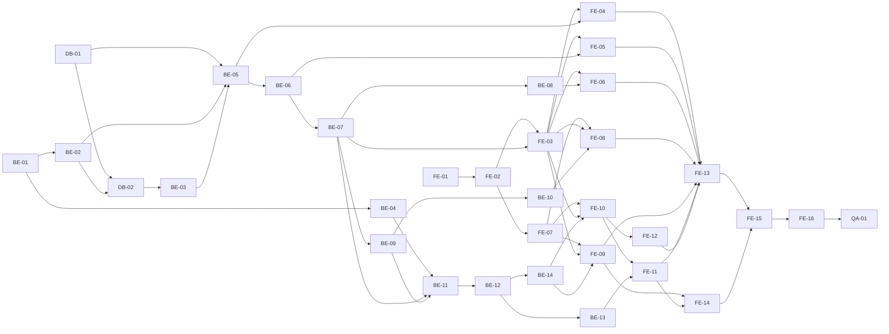

# cal-todo 작업 실행 계획 (WBS)

> 기준 문서: [도메인 정의서](1-domain-definition.md), [PRD](2-PRD.md), [사용자 시나리오](3-user-scenario.md), [와이어프레임](4-wireframes.md), [프로젝트 구조 설계 원칙](5-project-principle.md), [기술 아키텍처](6-arch-diagram.md), [ERD](7-erd.md), [schema.sql](schema.sql). FR/BR/WF/S/E ID는 기준 문서와 동일하다. 문서에 없던 결정은 §5에서 확정했다. 시간·공수 수치는 문서에 없으므로 적지 않는다.

## 1. 계획 개요와 일정 전략

### 1.1 개요
- 목표: FR-01 ~ FR-08 전체를 2일 내 핵심 기능으로 완성한다 (PRD §3, §7). 1인 개발이다.
- 대상 파일 경로는 5-project-principle.md §6 구조(`backend/`, `frontend/`)를 따른다. 기존 `team-caltalk/`는 수정하지 않는다.
- 범위 외: 배포, CI/CD, 로깅·모니터링, 동시접속 1000명 부하 검증(이번 범위 외, §5), 접근성, 비밀번호 정책, 모바일 전용 UI. 이 항목은 Task로 만들지 않는다.
- 단순함 우선(CLAUDE.md): 의존성 추가는 Task에 명시한 것만 쓰고, 문서에 없는 기능·추상화는 만들지 않는다.

### 1.2 일정 전략
| 배정일 | 내용 | 이유 |
|---|---|---|
| Day 1 | DB → 백엔드 전체(인증·카테고리·할일 API, 상태 판단, 필터, BR-09) + 프론트 셋업(FE-01) | 규칙(BR)의 단일 진실 원천이 백엔드이므로(원칙 1-3) API와 테스트를 먼저 고정한다. |
| Day 2 | 프론트 API 클라이언트·상태 관리·WF-01~07 화면·반응형·프론트 테스트 | 완성된 API에 붙여 화면 단위로 검증한다. |

진행 규칙
- Task는 완료 조건 체크박스를 모두 만족해야 완료다. 백엔드 Task는 해당 시나리오 ID를 이름에 넣은 테스트가 통과해야 한다 (원칙 4-1).
- 테스트 이름과 코드 주석에 FR/BR/S/E ID를 남긴다 (원칙 1-2).
- 미정 항목은 §5에서 모두 확정했다. 구현 중 새 미정 항목이 생기면 임의로 정하지 말고 코드에 `// 미정: <항목>` 주석만 남기고 관련 문서를 먼저 갱신한다 (원칙 1-8). 확정되지 않은 동작을 고정하는 테스트는 만들지 않는다 (원칙 4-7).

## 2. 전체 Task 목록

| ID | 영역 | Task명 | 선행 Task | 배정일 |
|---|---|---|---|---|
| DB-01 | DB | 스키마 적용 (schema.sql) | 없음 | Day 1 |
| DB-02 | DB | 공통 테스트 데이터 시드 (seed.js) | DB-01, BE-02 | Day 1 |
| BE-01 | 백엔드 | 프로젝트 셋업·환경설정·앱 골격 | 없음 | Day 1 |
| BE-02 | 백엔드 | pg 풀·오류 핸들러 | BE-01 | Day 1 |
| BE-03 | 백엔드 | 테스트 러너·fixtures | DB-02 | Day 1 |
| BE-04 | 백엔드 | 상태 판단 함수·KST 오늘 (todoStatus) | BE-01 | Day 1 |
| BE-05 | 백엔드 | 회원가입 API | DB-01, BE-02, BE-03 | Day 1 |
| BE-06 | 백엔드 | 로그인·토큰 재발급 API | BE-05 | Day 1 |
| BE-07 | 백엔드 | 인증 미들웨어 | BE-06 | Day 1 |
| BE-08 | 백엔드 | 내 정보 API | BE-07 | Day 1 |
| BE-09 | 백엔드 | 카테고리 조회·생성·수정 API | BE-07 | Day 1 |
| BE-10 | 백엔드 | 카테고리 삭제 API (BR-09 트랜잭션) | BE-09 | Day 1 |
| BE-11 | 백엔드 | 할일 등록 API | BE-04, BE-07, BE-09 | Day 1 |
| BE-12 | 백엔드 | 할일 조회 API (status 계산) | BE-11 | Day 1 |
| BE-13 | 백엔드 | 할일 필터 (카테고리 + 상태) | BE-12 | Day 1 |
| BE-14 | 백엔드 | 할일 수정·삭제 API | BE-12 | Day 1 |
| FE-01 | 프론트 | 프로젝트 셋업 | 없음 | Day 1 |
| FE-02 | 프론트 | API 클라이언트 (토큰 첨부·재발급) | FE-01 | Day 2 |
| FE-03 | 프론트 | 인증 훅·보호 라우트·공통 헤더 | FE-02, BE-07 | Day 2 |
| FE-04 | 프론트 | WF-01 회원가입 화면 | FE-03, BE-05 | Day 2 |
| FE-05 | 프론트 | WF-02 로그인 화면 | FE-03, BE-06 | Day 2 |
| FE-06 | 프론트 | WF-03 내 정보 수정 화면 | FE-03, BE-08 | Day 2 |
| FE-07 | 프론트 | 데이터 계층 (todo/category API·훅, uiStore) | FE-02 | Day 2 |
| FE-08 | 프론트 | WF-07 카테고리 관리 화면 | FE-03, FE-07, BE-10 | Day 2 |
| FE-09 | 프론트 | WF-06 할일 등록·수정 화면 | FE-03, FE-07, BE-14 | Day 2 |
| FE-10 | 프론트 | WF-04 목록 탭 (삭제·완료 체크) | FE-03, FE-07, BE-14 | Day 2 |
| FE-11 | 프론트 | WF-04 필터 (FR-07) | FE-10, BE-13 | Day 2 |
| FE-12 | 프론트 | WF-05 캘린더 탭 | FE-10 | Day 2 |
| FE-13 | 프론트 | 반응형 배치 | FE-04, FE-05, FE-06, FE-08, FE-09, FE-11, FE-12 | Day 2 |
| FE-14 | 프론트 | 프론트 테스트 (BR-04·BR-05·필터 전환) | FE-09, FE-11 | Day 2 |
| FE-15 | 프론트 | 다국어 (한국어·영어) | FE-13, FE-14 | Day 2 |
| FE-16 | 프론트 | 다크/라이트 모드 | FE-15 | Day 2 |
| QA-01 | 테스트 | E2E 통합 테스트 (S-01~S-09, E-01~E-10) | FE-16 | Day 2 |

영역별 개수: DB 2, 백엔드 14, 프론트 16, 테스트 1, 합계 33.

## 3. 선행 관계 요약

## 4. 영역별 Task 상세

공통 사항
- 백엔드 통합 테스트는 실제 PostgreSQL 테스트 DB를 사용한다 (원칙 4-8). 각 테스트 전에 BE-03의 `resetAndSeed()`로 공통 데이터를 초기화한다.
- 거부 테스트는 응답 코드뿐 아니라 DB 상태 불변까지 확인한다 (원칙 4-5).
- 응답 오류 형식은 `{ "error": { "code", "message" } }` 하나다 (원칙 §3, §5 확정).

### 4.1 DB

#### DB-01 스키마 적용
- 관련 ID: FR-01, FR-03~FR-08 / BR-04, BR-07, BR-09, BR-11
- 배정일: Day 1
- 선행 Task: 없음
- 수행 작업
  - `docs/schema.sql`을 내용 변경 없이 `backend/src/db/schema.sql`로 복사한다 (원칙 5.6: 스키마 단일 파일).
  - 로컬 PostgreSQL 17에 개발 DB와 테스트 DB를 만들고 스키마를 적용한다.
- 완료 조건
  - [x] 빈 DB에 `psql -f backend/src/db/schema.sql` 실행이 오류 없이 끝나고 `users`, `categories`, `todos` 테이블과 명시 인덱스 2개(`idx_todos_user_id`, `idx_todos_category_id`)가 존재한다. (`categories(user_id, name)`은 UNIQUE 제약이 인덱스를 자동 생성한다.)
  - [x] `start_date > end_date`인 todos INSERT는 `todos_date_range_check` 위반으로 실패하고, `start_date = end_date` INSERT는 성공한다 (BR-04, E-03의 DB 방어선).
  - [x] 같은 email의 users INSERT를 두 번 하면 두 번째가 UNIQUE 위반으로 실패한다 (BR-07).
  - [x] 같은 사용자에게 같은 이름의 categories INSERT를 두 번 하면 두 번째가 `categories_user_name_unique` 위반으로 실패하고, 다른 사용자에게는 같은 이름이 허용된다 (BR-11).
  - [x] 소속 할일이 있는 categories 행을 DELETE하면 FK(`ON DELETE RESTRICT`) 위반으로 실패한다 (BR-09 트랜잭션의 안전장치).
  - [x] `todos` 테이블에 상태(status) 컬럼이 없다 (원칙 1-4).

#### DB-02 공통 테스트 데이터 시드
- 관련 ID: S-01~S-09, E-01~E-10 (공통 데이터 3-user-scenario.md §3), 원칙 4-2
- 배정일: Day 1
- 선행 Task: DB-01, BE-02
- 수행 작업
  - `backend/src/db/seed.js`: 기존 데이터를 비우고(TRUNCATE ... RESTART IDENTITY CASCADE) USER-A, USER-B, 카테고리, TODO-A1~A6, TODO-B1을 삽입한다. `seed()` 함수를 export하고, 직접 실행(`node src/db/seed.js`)도 가능하게 한다.
  - 날짜는 D(KST 오늘) 기준 상대값을 SQL 표현식(`(now() AT TIME ZONE 'Asia/Seoul')::date + n`)으로 계산한다. 하드코딩하지 않는다 (원칙 4-2).
  - 비밀번호는 해시로 저장하고 테스트용 평문 값은 `TEST_PASSWORD` 상수 하나로 export한다.
  - NEW(new-user@example.com)는 미가입 상태 유지를 위해 삽입하지 않는다 (S-01).
- 완료 조건
  - [x] 실행 후 users 2건, categories 4건(USER-A: 기본·업무·개인, USER-B: 기본), todos 7건이 존재한다.
  - [x] TODO-A1~A6, B1의 카테고리·시작일자·종료일자·완료 여부가 3-user-scenario.md §3 표와 일치한다 (예: A2 = 업무, D ~ D+2, false / A5 = 개인, D-5 ~ D-1, true).
  - [x] 두 번 연속 실행해도 동일한 결과다 (건수·값 동일).
  - [x] users에 평문 비밀번호가 저장되지 않는다 (password_hash가 `TEST_PASSWORD`와 다른 문자열).
  - [x] `seed()`가 export되어 다른 모듈에서 호출할 수 있고, 라벨(USER-A, TODO-A1 등) → id 매핑을 반환한다.

### 4.2 백엔드

#### BE-01 프로젝트 셋업·환경설정·앱 골격
- 관련 ID: 원칙 1-9, 5.1, 5.6
- 배정일: Day 1
- 선행 Task: 없음
- 수행 작업
  - `backend/package.json`: express, pg, jsonwebtoken, cors, bcrypt(§5 확정)만 의존성으로 추가한다. dotenv는 넣지 않고 Node 내장 `--env-file`을 쓴다. Prisma·TypeScript 금지 (PRD §6).
  - `backend/src/config.js`: 필수 키(`DATABASE_URL`, `JWT_ACCESS_SECRET`, `JWT_REFRESH_SECRET`, `JWT_ACCESS_EXPIRES_IN`, `JWT_REFRESH_EXPIRES_IN`, `DB_POOL_MAX`, `PORT`, `CORS_ORIGIN`)를 읽고 검증한다. `process.env` 접근은 이 파일에서만 한다.
  - `backend/src/app.js`(express.json, cors(`CORS_ORIGIN`) 조립), `backend/src/server.js`(config 검증 후 기동), `backend/.env.example`(키 목록. 시크릿·연결 문자열은 비우고 `JWT_ACCESS_EXPIRES_IN=15m`, `JWT_REFRESH_EXPIRES_IN=7d`, `DB_POOL_MAX=20`은 §5 값으로 채운다).
  - `backend/src/routes/docsRoutes.js`: `/api-docs` Swagger UI(CDN)와 `/api-docs/swagger.yaml`(§5 확정). 선택 키 `NODE_ENV`도 `config.js`에서 읽어 `production`이면 등록하지 않는다(`config.isProduction`).
  - 루트 `.gitignore`에 `.env`가 없으면 추가한다.
- 완료 조건
  - [x] 필수 키 중 하나를 빼고 `server.js`를 실행하면 서버가 기동되지 않고, 누락된 키 이름만 출력한다 (비밀값은 출력하지 않는다).
  - [x] 모든 키를 넣으면 서버가 `PORT`에서 기동한다.
  - [x] `backend/src` 안에서 `process.env`를 참조하는 파일은 `config.js` 하나뿐이다 (grep으로 확인).
  - [x] `CORS_ORIGIN`과 다른 Origin의 요청은 CORS 허용 헤더를 받지 못한다.
  - [x] `.env.example`에 위 8개 키가 있고 시크릿·연결 문자열은 값이 비어 있으며 만료·풀 크기는 §5 값(`15m`, `7d`, `20`)이 들어 있다. `.env`는 git 추적 대상에서 제외된다.
  - [x] `/api-docs`가 인증 없이 열리고 `NODE_ENV=production`에서는 404다.

#### BE-02 pg 풀·오류 핸들러
- 관련 ID: 원칙 1-7, 5.5, §3(오류 응답 형식)
- 배정일: Day 1
- 선행 Task: BE-01
- 수행 작업
  - `backend/src/db/pool.js`: `pg.Pool` 싱글턴 1개(`max`는 `DB_POOL_MAX`). DATE 컬럼(OID 1082)을 Date 객체가 아닌 `YYYY-MM-DD` 문자열로 반환하도록 pg 타입 파서를 설정한다 (원칙 1-7).
  - `backend/src/middlewares/errorHandler.js`: `AppError(status, code, message)`와 오류 핸들러. 모든 오류를 `{ "error": { "code", "message" } }`로 변환한다. `app.js`에 등록한다.
  - `backend/src/routes/healthRoutes.js`(추가, 2026-10-02): 인증 없는 `GET /api/health`. 풀로 `SELECT 1`을 실행해 200 `{ status: 'ok', db: 'ok' }`, 실패·3초 초과 시 503 `{ status: 'error', db: 'error' }`(오류 원문 미노출).
- 완료 조건
  - [x] `pool.js`를 여러 파일에서 import해도 Pool 인스턴스는 1개다.
  - [x] `GET /api/health`가 인증 없이 200을 반환하고, DB 쿼리가 실패하면 503이며 오류 원문을 노출하지 않는다 (`infra.test.js`).
  - [x] `SELECT start_date FROM todos` 결과가 `"2026-10-07"` 형식 문자열이다 (Date 객체가 아님).
  - [x] 라우트에서 `AppError(400, "X", "msg")`를 던지면 HTTP 400과 `{ error: { code: "X", message: "msg" } }`가 응답된다.
  - [x] 예상치 못한 예외는 HTTP 500과 일반 메시지만 응답하고, 스택·SQL·비밀값이 응답에 포함되지 않는다.

#### BE-03 테스트 러너·fixtures
- 관련 ID: 원칙 4-1, 4-2, 4-8
- 배정일: Day 1
- 선행 Task: DB-02
- 수행 작업
  - `backend/package.json`에 `test` 스크립트를 추가한다 (Node 내장 `node --test`, 추가 의존성 없음. §5 확정).
  - `backend/tests/fixtures.js`: DB-02의 `seed()`를 재사용하는 `resetAndSeed()`, 라벨 → id 맵, `TEST_PASSWORD` 재노출, 서버 기동·요청·토큰 헬퍼. DB 이름이 `_test`로 끝나지 않으면 즉시 실패한다. 시드 로직을 복제하지 않는다.
  - 테스트는 `DATABASE_URL`이 테스트 DB를 가리킬 때만 실행한다.
- 완료 조건
  - [x] `npm test` 실행 시 `tests/` 아래 테스트가 실행된다.
  - [x] `resetAndSeed()`를 두 번 호출해도 users 2건, categories 4건, todos 7건이다 (DB-02와 동일).
  - [x] 반환된 맵으로 TODO-A1~A6, TODO-B1, USER-A/B, 카테고리(기본/업무/개인)의 id를 조회할 수 있다.
  - [x] `fixtures.js`가 날짜를 하드코딩하지 않는다 (DB-02의 상대 날짜만 사용).

#### BE-04 상태 판단 함수·KST 오늘
- 관련 ID: FR-06, FR-07 / BR-08 / E-06 / 원칙 1-4, 1-6, 4-3
- 배정일: Day 1
- 선행 Task: BE-01
- 수행 작업
  - `backend/src/services/todoStatus.js`: `getTodayKst(now = new Date())`(`YYYY-MM-DD` 반환)와 `getTodoStatus({ startDate, endDate, isCompleted }, today)`. 판단 순서 완료 → 기한 초과 → 시작 전 → 진행중, 반환 값은 `completed`/`overdue`/`upcoming`/`in_progress`. `today`는 인자로 주입한다. 판단 함수는 이 1개만 둔다.
  - `backend/tests/todoStatus.test.js`: 단위 테스트.
- 완료 조건
  - [x] `E-06` 표 5건이 통과한다 (시작일=오늘 미완료 → `in_progress`, 종료일=오늘 미완료 → `in_progress`, 종료일=어제 미완료 → `overdue`, 종료일=어제 완료 → `completed`, 시작일>오늘 미완료 → `upcoming`).
  - [x] 도메인 §3 경계 예시 4건이 통과한다.
  - [x] TODO-A1~A6 조건이 각각 `upcoming`, `in_progress`, `in_progress`, `overdue`, `completed`, `in_progress`를 반환한다.
  - [x] `getTodayKst(new Date("2026-09-30T15:00:00Z"))`는 `"2026-10-01"`, `getTodayKst(new Date("2026-09-30T14:59:59Z"))`는 `"2026-09-30"`이다 (BR-08 KST 경계).
  - [x] 테스트 이름에 `E-06`이 포함된다.

#### BE-05 회원가입 API
- 관련 ID: FR-01 / BR-01, BR-03, BR-07 / S-01, E-01
- 배정일: Day 1
- 선행 Task: DB-01, BE-02, BE-03
- 수행 작업
  - `backend/src/repositories/userRepository.js`(이메일 조회·사용자 생성), `backend/src/repositories/categoryRepository.js`(카테고리 생성 함수만 우선 작성, BE-09에서 확장).
  - `backend/src/services/authService.js`의 `signup`: 이메일 중복 시 `AppError`(BR-07), 비밀번호 해시 저장, 사용자 생성과 '기본' 카테고리 생성을 한 트랜잭션으로 처리한다 (§5 확정). 이메일은 앞뒤 공백 제거·소문자로 정규화해 조회·저장한다 (BR-07). 서비스 코드에서 '기본' 이름은 `DEFAULT_CATEGORY_NAME` 상수 한 곳에서만 참조한다 (시드 데이터 표는 예외).
  - `backend/src/routes/authRoutes.js`: `POST /api/auth/signup` (이메일·비밀번호·이름 필수값 형식 검증). 응답에 비밀번호 해시를 포함하지 않는다. `app.js`에 `/api/auth` 등록.
  - `backend/tests/auth.test.js`에 S-01, E-01 테스트.
- 완료 조건
  - [x] `S-01 회원가입`: NEW 정보로 `POST /api/auth/signup` → 201, DB에 users 1건 추가, `password_hash`는 평문과 다르고 응답 본문에 `password`/`passwordHash`가 없다.
  - [x] `S-01` 가입 직후 해당 사용자의 '기본' 카테고리가 1건 존재한다 (BR-03 전제).
  - [x] `E-01 중복 이메일 가입`: USER-A 이메일로 가입 → 409와 `error.code = EMAIL_DUPLICATED`, users 건수 불변 (BR-07). 대소문자만 다른 이메일(`USER-A@Example.com`)도 409다.
  - [x] 필수값(이메일·비밀번호·이름) 누락 시 400이고 DB 변경이 없다.
  - [x] 가입 응답에 토큰이 없다 (가입 후 로그인해야 앱 사용 가능, BR-01).

#### BE-06 로그인·토큰 재발급 API
- 관련 ID: FR-01 / BR-01 / S-02, E-02
- 배정일: Day 1
- 선행 Task: BE-05
- 수행 작업
  - `authService.js`에 `login`, `refresh` 추가. Access/Refresh는 서로 다른 시크릿으로 서명하고 만료는 `JWT_ACCESS_EXPIRES_IN`/`JWT_REFRESH_EXPIRES_IN` 환경변수를 사용한다 (코드에 만료 수치 하드코딩 금지, 원칙 1-9). Refresh Token은 서버에 저장하지 않는다 (§5 확정). 이메일은 가입과 같은 방식으로 정규화해 조회한다. 로그인 실패 메시지는 "이메일 또는 비밀번호가 올바르지 않습니다."로 고정한다.
  - `authRoutes.js`에 `POST /api/auth/login`(응답: `accessToken`, `refreshToken`, `user{id,email,name}`), `POST /api/auth/refresh`(요청: `refreshToken`, 응답: 새 `accessToken`) 추가.
  - `auth.test.js`에 S-02, E-02 관련 테스트 추가.
- 완료 조건
  - [x] `S-02 로그인`: USER-A 이메일·`TEST_PASSWORD`로 로그인 → 200, `accessToken`·`refreshToken` 반환, 두 토큰의 payload에 USER-A id가 있다.
  - [x] 잘못된 비밀번호와 존재하지 않는 이메일은 동일한 401 응답(같은 code, message "이메일 또는 비밀번호가 올바르지 않습니다.")이다 (원칙 5.3).
  - [x] Access Token은 Refresh 시크릿으로, Refresh Token은 Access 시크릿으로 검증하면 실패한다.
  - [x] `E-02` 유효한 Refresh Token으로 `/api/auth/refresh` → 200과 새 Access Token. 위조·만료 Refresh Token, Access Token을 넣은 경우는 401.
  - [x] 로그인·재발급 응답과 로그에 비밀번호 해시가 없다.

#### BE-07 인증 미들웨어
- 관련 ID: BR-01 / E-02 / 원칙 2.1, 5.2
- 배정일: Day 1
- 선행 Task: BE-06
- 수행 작업
  - `backend/src/middlewares/auth.js`: `Authorization: Bearer` Access Token 검증 → `req.user.id` 설정. 실패 시 401 `AppError`.
  - `app.js`에서 `/api/users`, `/api/todos`, `/api/categories` 라우터 앞단에 적용한다 (공개 API는 `/api/auth/*`와 `/api/health`뿐).
  - `auth.test.js`에 미들웨어 테스트 추가.
- 완료 조건
  - [x] `E-02 미인증 접근`: 토큰 없음 → 401, 위조 토큰 → 401.
  - [x] `E-02 만료 토큰`: `expiresIn`이 지난 Access Token → 401.
  - [x] Refresh Token을 Access 자리에 보내면 401이다.
  - [x] 유효한 Access Token이면 `req.user.id`가 토큰의 사용자 id로 설정되고 다음 핸들러가 호출된다.
  - [x] `app.js`에서 `/api/auth/*` 외 모든 `/api` 라우터가 이 미들웨어를 거친다 (라우트 등록 코드 확인).

#### BE-08 내 정보 API
- 관련 ID: FR-02 / BR-01 / S-03
- 배정일: Day 1
- 선행 Task: BE-07
- 수행 작업
  - `userRepository.js`에 조회·이름 수정 추가, `backend/src/services/userService.js`, `backend/src/routes/userRoutes.js`: `GET /api/users/me`, `PATCH /api/users/me`(수정 항목은 이름만, §5 확정). 대상 사용자는 항상 `req.user.id`다.
  - 테스트 파일은 `backend/tests/auth.test.js`에 S-03 케이스를 추가한다 (원칙 §6 구조에 별도 파일이 없다).
- 완료 조건
  - [x] `S-03 내 정보 수정`: USER-A 토큰으로 `PATCH /api/users/me { name }` → 200, 재조회(`GET /api/users/me`) 시 변경된 이름이 반환된다.
  - [x] 요청 본문에 다른 사용자의 id나 `email`을 넣어도 무시되고 USER-B의 이름과 USER-A의 이메일은 변하지 않는다.
  - [x] 응답에 `password_hash`가 없다.
  - [x] `name`이 없거나 빈 문자열이면 400이고 DB 변경이 없다.
  - [x] 토큰 없이 호출하면 401이다 (BR-01).

#### BE-09 카테고리 조회·생성·수정 API
- 관련 ID: FR-08 / BR-01, BR-03, BR-10, BR-11 / S-09, E-10
- 배정일: Day 1
- 선행 Task: BE-07
- 수행 작업
  - `categoryRepository.js` 확장(본인 목록, 단건 조회, 생성, 이름 수정 — 모든 쿼리에 `user_id` 조건), `backend/src/services/categoryService.js`, `backend/src/routes/categoryRoutes.js`: `GET /api/categories`, `POST /api/categories`, `PATCH /api/categories/:id`. 이름 검증: 빈 값 400, 앞뒤 공백 제거 후 100자 초과 400, 같은 사용자 안의 이름 중복 409 (BR-11). '기본' 카테고리 수정 요청은 400 `DEFAULT_CATEGORY_PROTECTED`로 거부한다 (BR-10).
  - `backend/tests/categories.test.js`에 S-09 테스트.
- 완료 조건
  - [x] `S-09 카테고리 목록`: USER-A 토큰으로 `GET /api/categories` → 기본·업무·개인 3건만, USER-B의 '기본'은 포함되지 않는다.
  - [x] `S-09 카테고리 생성`: `POST` → 201, USER-A 소유로 저장되고 목록에 나타난다.
  - [x] `S-09 카테고리 수정`: USER-A가 '개인' 이름을 수정 → 200, 재조회 시 반영된다.
  - [x] 타인 카테고리(USER-B의 '기본') 수정 요청은 거부(404)되고 이름이 변하지 않는다 (사용자별 소유, 원칙 5.4).
  - [x] 빈 이름은 400, 같은 사용자의 기존 이름(예: '업무')으로 생성·수정하면 409이며 DB 변경이 없다 (BR-11). 다른 사용자(USER-B)와 같은 이름은 허용된다.
  - [x] `E-10` USER-A가 '기본' 수정 요청 → 400 `DEFAULT_CATEGORY_PROTECTED`이고 이름이 변하지 않는다 (BR-10).

#### BE-10 카테고리 삭제 API (BR-09 트랜잭션)
- 관련 ID: FR-08 / BR-03, BR-09, BR-10 / S-09, E-09, E-10
- 배정일: Day 1
- 선행 Task: BE-09
- 수행 작업
  - `categoryService.js`의 삭제: 소유 확인 후 `pool.connect()`로 Client를 얻어 BEGIN → 사용자 '기본' 카테고리 id 조회 → `UPDATE todos SET category_id = $default WHERE category_id = $1 AND user_id = $2` → `DELETE FROM categories WHERE id = $1 AND user_id = $2` → COMMIT. 오류 시 ROLLBACK, `finally`에서 `release()` (원칙 2.1, 5.5, ERD §3).
  - `categoryRoutes.js`에 `DELETE /api/categories/:id`. 삭제 확인(`window.confirm`)은 프론트에서만 처리하며 서버에는 확인 절차가 없다.
  - `categories.test.js`에 E-09 테스트.
- 완료 조건
  - [x] `E-09 카테고리 삭제 시 할일 이동`: USER-A가 '업무' 삭제 → 204(성공), '업무' 행 없음, TODO-A1·A2·A4의 category가 '기본'이고 todos 총 건수는 삭제 전과 같다 (BR-09, 할일 미삭제).
  - [x] 삭제된 카테고리에 속하지 않던 TODO-A3·A5(개인)·A6 및 USER-B 데이터는 변하지 않는다.
  - [x] 타인 카테고리 삭제 요청은 거부되고(404) 해당 카테고리·할일 모두 불변이다 (BR-02 원칙 5.4).
  - [x] 트랜잭션 중간 실패 시 롤백되어 할일 이동도 취소된다 (테스트에서 DELETE 단계를 실패시켜 todos의 category_id가 원상태임을 확인).
  - [x] 트랜잭션 Client는 성공·실패 모두에서 `release()`된다 (코드 확인: `finally`).
  - [x] `E-10` '기본' 카테고리 삭제 요청 → 400 `DEFAULT_CATEGORY_PROTECTED`, '기본' 카테고리와 todos 건수 불변 (BR-10).

#### BE-11 할일 등록 API
- 관련 ID: FR-03 / BR-01, BR-02, BR-03, BR-04, BR-05(서버측), BR-06 / S-04, E-03, E-04
- 배정일: Day 1
- 선행 Task: BE-04, BE-07, BE-09
- 수행 작업
  - `backend/src/repositories/todoRepository.js`(INSERT, 행 → camelCase 객체 변환), `backend/src/services/todoService.js`, `backend/src/routes/todoRoutes.js`: `POST /api/todos`. 필수값·`YYYY-MM-DD` 형식은 routes에서, 규칙은 service에서 판단한다.
  - service 규칙: `startDate` 미전달 시 KST 오늘 + 7일, `endDate` 미전달 시 `startDate`(BR-05). `startDate ≤ endDate` 위반 시 400 (BR-04). `categoryId` 미전달 시 본인 '기본' 카테고리 id (BR-03). `categoryId`가 본인 소유가 아니면 거부(404). `user_id`는 `req.user.id`만 사용한다. 응답 todo에는 `status`(BE-04 함수)를 포함한다.
  - `backend/tests/todos.test.js`에 테스트.
- 완료 조건
  - [x] `S-04 할일 등록(기본값)`: 제목만 전달 → 201, `startDate = D+7`, `endDate = D+7`, `isCompleted=false`, 소유자 USER-A (D는 KST 오늘).
  - [x] `E-04 카테고리 미지정 등록`: `categoryId` 없이 등록 → 저장된 할일의 category가 USER-A의 '기본'이다 (BR-03).
  - [x] `E-03 종료일자 < 시작일자`: `startDate=D+3, endDate=D+2` → 400과 오류 응답, todos 건수 불변 (BR-04).
  - [x] `E-03` 같은 날(`startDate = endDate`) 등록은 201이다.
  - [x] USER-B 소유 카테고리 id를 지정해 등록하면 거부되고 todos 건수가 불변이다.
  - [x] 요청 본문에 `userId`를 넣어도 무시되고 토큰 사용자 소유로 저장된다.
  - [x] 제목 누락 또는 날짜 형식 오류는 400이고 DB 변경이 없다.

#### BE-12 할일 조회 API (status 계산)
- 관련 ID: FR-06 / BR-02, BR-08 / S-07, E-05, E-06
- 배정일: Day 1
- 선행 Task: BE-11
- 수행 작업
  - `todoRepository.js`에 목록·단건 조회 추가(항상 `WHERE user_id = $n`, 단건은 `WHERE id = $1 AND user_id = $2`), `todoService.js`에서 각 항목에 `getTodoStatus(todo, getTodayKst())` 결과를 `status`로 부여한다.
  - `todoRoutes.js`에 `GET /api/todos`, `GET /api/todos/:id`(편집 화면용). 목록 정렬은 `start_date`, `id` 오름차순(§5 확정). 캘린더 탭도 이 목록을 그대로 쓴다(전용 파라미터 없음, §5 확정).
  - `todos.test.js`에 테스트.
- 완료 조건
  - [x] `S-07 목록 조회`: USER-A 토큰 `GET /api/todos` → TODO-A1~A6 6건만 반환하고 TODO-B1은 없다 (BR-02).
  - [x] `E-06` 각 항목의 `status`가 A1 `upcoming`, A2 `in_progress`, A3 `in_progress`, A4 `overdue`, A5 `completed`, A6 `in_progress`다.
  - [x] `E-05 타인 할일 조회`: USER-A가 `GET /api/todos/{TODO-B1 id}` → 거부(404), 응답에 B1의 내용이 없다.
  - [x] USER-B 토큰의 목록에는 TODO-B1만 있다.
  - [x] 응답 필드는 camelCase(`startDate`, `endDate`, `isCompleted`, `categoryId`)이고 날짜는 `YYYY-MM-DD`이며 `status` 영문 코드를 포함한다.

#### BE-13 할일 필터 (카테고리 + 상태)
- 관련 ID: FR-07 / BR-02, BR-08 / S-08, E-07, E-08 / 원칙 1-5, 4-4
- 배정일: Day 1
- 선행 Task: BE-12
- 수행 작업
  - `todoRepository.js`: `categoryId`(선택), `status`(선택, 1개), 서버가 산출한 KST 오늘을 `$today` 파라미터로 받는 WHERE 조건. 상태 조건은 BE-04와 같은 순서 의미로 작성한다 (`completed`: `is_completed`, `overdue`: `NOT is_completed AND end_date < $today`, `upcoming`: `NOT is_completed AND end_date >= $today AND start_date > $today`, `in_progress`: `NOT is_completed AND start_date <= $today AND end_date >= $today`). 항상 `user_id` 조건을 포함한다.
  - `todoRoutes.js`: `GET /api/todos?categoryId=&status=` (status 값 검증).
  - `todos.test.js`에 필터 테스트.
- 완료 조건
  - [x] 원칙 1-5: TODO-A1~A6에 대해 각 `status` 필터 결과 id 집합이 BE-04 판단 함수 결과와 일치한다 (`upcoming`={A1}, `in_progress`={A2,A3,A6}, `completed`={A5}, `overdue`={A4}).
  - [x] `E-07 기한 초과 필터`: `status=overdue` → A4만, A5(완료)는 제외된다.
  - [x] `E-08 필터 조합`: `categoryId=업무` + `status=in_progress` → {A2}, `categoryId=업무` + `status=overdue` → {A4}, `categoryId=업무` + `status=completed` → 빈 배열(200).
  - [x] `S-08`: `categoryId=개인`만 → {A3, A5}, 필터 없음 → 6건.
  - [x] 허용되지 않는 `status` 값은 400이다.
  - [x] USER-A가 USER-B의 categoryId로 필터해도 USER-B 할일이 반환되지 않는다 (BR-02).

#### BE-14 할일 수정·삭제 API
- 관련 ID: FR-04, FR-05 / BR-02, BR-03, BR-04, BR-06, BR-12 / S-05, S-06, E-03, E-05, E-06
- 배정일: Day 1
- 선행 Task: BE-12
- 수행 작업
  - `todoRepository.js`에 UPDATE·DELETE 추가(모두 `WHERE id = $1 AND user_id = $2`, 영향 행 0이면 거부). `todoService.js`: 수정은 기존 값에 요청 값을 합친 결과로 BR-04 검증(한쪽 날짜만 바꿔도 검증), `categoryId` 본인 소유 검증.
  - `todoRoutes.js`: `PATCH /api/todos/:id`(title, categoryId, startDate, endDate, isCompleted 부분 수정. 완료 처리는 별도 API 없이 `isCompleted` 수정으로 처리, §5 확정), `DELETE /api/todos/:id`.
  - `todos.test.js`에 테스트.
- 완료 조건
  - [x] `S-05 할일 수정`: USER-A가 TODO-A2의 제목·카테고리·날짜를 수정 → 200, 재조회 시 반영된다.
  - [x] `E-03` 수정 시 종료일자 < 시작일자 → 400이고 기존 값 불변. 시작일자만 기존 종료일자보다 늦게 바꾸는 경우도 400이다. 같은 날은 200이다.
  - [x] `E-05 타인 할일 수정`: USER-A가 TODO-B1 `PATCH` → 거부(404), B1의 DB 값이 불변이다.
  - [x] `E-05 타인 할일 삭제`: USER-A가 TODO-B1 `DELETE` → 거부(404), B1이 그대로 존재한다.
  - [x] `S-06 할일 삭제`: USER-A가 TODO-A2 `DELETE` → 204, 이후 목록에서 사라지고 다른 할일(A1, A3~A6)은 불변이다.
  - [x] `isCompleted: true`로 수정하면 이후 조회의 `status`가 `completed`다 (E-06). `isCompleted: false`로 되돌리면 `status`가 날짜 기준(KST 오늘)으로 다시 계산된다 (BR-12).
  - [x] 타인 소유 `categoryId`로 수정하면 거부되고 할일이 불변이다.

### 4.3 프론트엔드

공통 사항
- 서버 데이터는 TanStack Query만, UI 상태는 Zustand만 사용한다 (PRD §6, 원칙 2.2). 필터링·상태 재계산은 클라이언트에서 하지 않는다 (원칙 1-4, 2.2).
- 프론트 완료 조건 중 "화면 확인"은 BE 서버와 DB-02 시드를 띄운 상태(USER-A 로그인)에서 브라우저로 확인한다. QA-01 E2E 통합 테스트는 기존 데이터를 지우지 않도록 `test/e2e/setup.mjs`로 API를 통해 공통 데이터를 만든다.

#### FE-01 프로젝트 셋업
- 관련 ID: PRD §6, 원칙 §3, §5.1
- 배정일: Day 1
- 선행 Task: 없음
- 수행 작업
  - `frontend/`에 React 19 + TypeScript 프로젝트 생성(빌드 도구 Vite, 라우터 react-router, §5 확정). 의존성은 react, react-dom, react-router, zustand, @tanstack/react-query와 빌드에 필요한 것만 추가한다.
  - `frontend/package.json`, `frontend/tsconfig.json`, `frontend/.env.example`(`VITE_API_BASE_URL`, 값 비움), 빌드 도구 필수 파일(`index.html`, `vite.config.ts`).
  - `frontend/src/main.tsx`(QueryClientProvider, 라우터), `frontend/src/App.tsx`(빈 라우트 골격), `frontend/src/constants.ts`(상태 코드 → 한글 라벨, '기본' 카테고리 이름 상수).
- 완료 조건
  - [x] `npm run dev` 기동 후 브라우저 콘솔 오류 없이 빈 화면이 로드된다.
  - [x] `npx tsc --noEmit`과 `npm run build`가 오류 없이 끝난다.
  - [x] `constants.ts`가 `upcoming`→시작 전, `in_progress`→진행중, `completed`→완료, `overdue`→기한 초과 4개 매핑을 한 곳에서 제공한다. (FE-15에서 매핑 위치를 `i18n.ts`로 옮김)
  - [x] 프론트 코드·`.env.example`에 비밀값이 없다 (원칙 5.1).

#### FE-02 API 클라이언트 (토큰 첨부·재발급)
- 관련 ID: FR-01 / BR-01 / S-02, E-02 / 원칙 2.2, 5.2, arch §2
- 배정일: Day 2
- 선행 Task: FE-01
- 수행 작업
  - `frontend/src/api/types.ts`: `Todo`, `Category`, `User`, `TodoStatus` 타입을 직접 정의한다 (타입 공유 패키지 금지, 원칙 2.3).
  - `frontend/src/api/client.ts`: fetch 래퍼. Access Token 첨부, 401 수신 시 `POST /api/auth/refresh`로 1회 재발급 후 원 요청 재시도, 재발급 실패 시 토큰 삭제 후 `/login`으로 이동한다. 로그인·가입·재발급 요청 자체는 이 재발급 루프에서 제외한다. 토큰은 `localStorage`(§5 확정)에 두되 접근은 이 파일 한 곳으로 한정한다. 오류 응답의 `error.code`/`message`를 담은 `ApiError`를 던진다.
- 완료 조건
  - [x] 백엔드 `JWT_ACCESS_EXPIRES_IN`을 짧게 설정한 개발 환경에서 Access Token 만료 후 요청하면, 재발급 1회 후 원 요청이 성공하고 사용자에게 오류가 보이지 않는다 (arch §2 흐름, 수동 확인 기준. QA-01 E2E에서는 재현하지 않음, test/e2e/test-report.md §5).
  - [x] `E-02` Refresh Token까지 만료/삭제된 상태에서 요청하면 저장된 토큰이 지워지고 `/login`으로 이동한다 (BR-01).
  - [x] 이 재발급·로그인 이동 처리가 `client.ts` 한 곳에만 존재한다 (다른 파일에 없음, grep 확인).
  - [x] `api/`가 store·컴포넌트를 import하지 않는다 (원칙 2.2).
  - [x] 서버 오류 응답이 `ApiError.code`/`message`로 호출자에게 전달된다.

#### FE-03 인증 훅·보호 라우트·공통 헤더
- 관련 ID: FR-01, FR-02 / BR-01 / E-02 / WF 공통 헤더
- 배정일: Day 2
- 선행 Task: FE-02, BE-07
- 수행 작업
  - `frontend/src/api/authApi.ts`(`/api/auth/*`, `/api/users/me` 호출), `frontend/src/hooks/useAuth.ts`(가입·로그인·내 정보 조회·수정·로그아웃 훅).
  - `frontend/src/App.tsx`: 보호 라우트(토큰 없으면 `/login`으로 이동, BR-01)와 공통 레이아웃. 각 화면 Task가 자기 라우트를 이 파일에 등록한다. `/`는 임시 placeholder로 등록한다(FE-10에서 교체).
  - `frontend/src/components/Header.tsx`: 할일(`/`), 카테고리(`/categories`), 내 정보(`/profile`) 링크와 로그아웃(토큰 삭제 후 `/login`, §5 확정).
- 완료 조건
  - [x] `E-02` 로그아웃 상태에서 `/`, `/profile`, `/categories`, `/todos/new`에 접근하면 `/login`으로 이동한다.
  - [x] 로그인 상태(토큰 보유)에서 보호 경로에 접근하면 헤더와 본문이 표시된다.
  - [x] 헤더 로그아웃 클릭 시 저장 토큰이 삭제되고 `/login`으로 이동한다.
  - [x] `useAuth.ts` 외의 컴포넌트가 `api`를 직접 import하지 않는다 (원칙 2.2).

#### FE-04 WF-01 회원가입 화면
- 관련 ID: FR-01 / BR-01, BR-07 / WF-01 / S-01, E-01
- 배정일: Day 2
- 선행 Task: FE-03, BE-05
- 수행 작업
  - `frontend/src/pages/SignupPage.tsx`: 이메일·비밀번호·이름 입력, 가입하기, 로그인 링크. 성공 시 `/login`으로 이동한다 (자동 로그인 안 함, §5 확정). `/signup` 라우트를 `App.tsx`에 등록(공개).
- 완료 조건
  - [x] `S-01` NEW 정보로 가입 → 성공 후 `/login`으로 이동하고, 로그인 전에는 보호 화면에 접근할 수 없다.
  - [x] `E-01` USER-A 이메일로 가입 → 가입되지 않고 이메일 입력창 아래에 서버 오류 안내가 표시된다 (BR-07).
  - [x] 비밀번호 정책(길이·복잡도) 검사를 넣지 않는다 (범위 제외).

#### FE-05 WF-02 로그인 화면
- 관련 ID: FR-01 / BR-01 / WF-02 / S-02, E-02
- 배정일: Day 2
- 선행 Task: FE-03, BE-06
- 수행 작업
  - `frontend/src/pages/LoginPage.tsx`: 이메일·비밀번호 입력, 로그인, 회원가입 링크. 성공 시 토큰을 저장(`client.ts` 경유)하고 `/`로 이동한다. `/login` 라우트 등록.
- 완료 조건
  - [x] `S-02` USER-A로 로그인 → `/`로 이동하고 토큰 2개가 저장된다.
  - [x] 잘못된 비밀번호 → "이메일 또는 비밀번호가 올바르지 않습니다."가 표시되고 `/login`에 머문다 (이메일 존재 여부를 구분해 표시하지 않는다).
  - [x] 회원가입 링크로 `/signup`에 이동할 수 있다.

#### FE-06 WF-03 내 정보 수정 화면
- 관련 ID: FR-02 / BR-01 / WF-03 / S-03
- 배정일: Day 2
- 선행 Task: FE-03, BE-08
- 수행 작업
  - `frontend/src/pages/ProfilePage.tsx`: 현재 이름을 불러와 표시, 이름 수정·저장. `/profile` 라우트 등록.
- 완료 조건
  - [x] `S-03` 이름 수정 후 저장 → 성공 표시, 페이지를 새로고침해도 변경된 이름이 보인다.
  - [x] 이름을 비우고 저장하면 서버 오류 메시지가 표시되고 기존 이름이 유지된다.
  - [x] 이름 외 항목(이메일·비밀번호) 입력란이 없다 (§5 확정).

#### FE-07 데이터 계층 (todo/category API·훅, uiStore)
- 관련 ID: FR-03~FR-08 / 원칙 2.2
- 배정일: Day 2
- 선행 Task: FE-02
- 수행 작업
  - `frontend/src/api/todoApi.ts`(`/api/todos` 목록·단건·등록·수정·삭제, 필터 쿼리), `frontend/src/api/categoryApi.ts`(`/api/categories` CRUD).
  - `frontend/src/hooks/useTodos.ts`, `frontend/src/hooks/useCategories.ts`: TanStack Query 훅. 할일 쿼리 키에 필터 값을 포함한다. 할일 변경 mutation은 할일 쿼리를 무효화하고, 카테고리 삭제 mutation은 카테고리와 할일 쿼리를 모두 무효화한다 (BR-09 결과 반영).
  - `frontend/src/stores/uiStore.ts`(`useUiStore`): 활성 탭(list/calendar), 카테고리 필터, 상태 필터(단일 값), 캘린더 현재 월. 서버 데이터는 담지 않는다.
- 완료 조건
  - [x] `npx tsc --noEmit`이 통과한다.
  - [x] `useUiStore`의 상태 필터는 단일 값이며 `setStatus("overdue")` 후 `setStatus("completed")`를 호출하면 `completed` 하나만 남는다 (E-08 대체 규칙).
  - [x] `useTodos`의 쿼리 키에 `categoryId`, `status`가 포함되고, 값이 없으면 쿼리스트링에 붙지 않는다.
  - [x] 서버 데이터(할일·카테고리 목록)가 Zustand에 저장되지 않는다 (코드 확인).
  - [x] 카테고리 삭제 mutation 성공 시 할일 쿼리도 무효화된다 (코드 확인, 동작은 FE-08에서 검증).

#### FE-08 WF-07 카테고리 관리 화면
- 관련 ID: FR-08 / BR-01, BR-03, BR-09, BR-10, BR-11 / WF-07 / S-09, E-09, E-10
- 배정일: Day 2
- 선행 Task: FE-03, FE-07, BE-10
- 수행 작업
  - `frontend/src/pages/CategoryPage.tsx`: 본인 카테고리 목록, 추가(이름 입력), 이름 수정, 삭제. 카테고리 삭제는 `window.confirm` 승인 후 요청한다 (§5 확정). '기본' 이름의 행은 수정·삭제 버튼을 숨긴다 (BR-10). 이름 중복(409)·빈 값 오류는 서버 메시지를 표시한다. `/categories` 라우트 등록.
- 완료 조건
  - [x] `S-09` 카테고리를 추가하면 목록에 나타나고, 이름을 수정하면 반영되며, 삭제하면 사라진다.
  - [x] `E-09` USER-A로 '업무' 삭제 후 목록 탭(`/`)에서 A1·A2·A4가 '기본'으로 표시되고 할일 6건이 그대로다 (BR-09).
  - [x] 빈 이름 또는 이미 있는 이름으로 추가하면 서버 오류 메시지가 표시되고 목록이 늘지 않는다 (BR-11).
  - [x] 삭제 시 확인창이 뜨고 취소하면 카테고리가 그대로이며, 승인하면 삭제된다.
  - [x] '기본' 행에는 수정·삭제 버튼이 없다 (BR-10, E-10).
  - [x] 다른 사용자(USER-B)의 카테고리는 목록에 나타나지 않는다.

#### FE-09 WF-06 할일 등록·수정 화면
- 관련 ID: FR-03, FR-04 / BR-02~BR-06 / WF-06 / S-04, S-05, E-03, E-04, E-05
- 배정일: Day 2
- 선행 Task: FE-03, FE-07, BE-14
- 수행 작업
  - `frontend/src/components/DatePicker.tsx`: 브라우저 기본 `<input type="date">`를 감싼 날짜 선택 컴포넌트 (BR-06, 별도 라이브러리 미도입).
  - `frontend/src/pages/TodoFormPage.tsx`: 등록(`/todos/new`)과 수정(`/todos/:id/edit`)을 한 화면으로 처리한다. 등록 시 시작일자 초기값은 KST 오늘 + 7일, 종료일자 초기값은 시작일자와 동일하다(BR-05, 초기값 계산 함수는 이 파일에서 export해 테스트에서 재사용). 카테고리는 본인 카테고리 선택이며 선택하지 않으면 `categoryId`를 보내지 않는다(BR-03). 종료일자 < 시작일자이면 요청을 보내지 않고 오류를 표시한다(UX용, 최종 판단은 서버 응답). 수정 시 기존 값을 채우고 제목은 "할일 수정". 저장 성공 시 `/`, 취소 시 이전 화면. 완료 처리는 이 화면에 두지 않는다 (§5 확정).
- 완료 조건
  - [x] `S-04` 등록 화면 진입 시 시작일자 = 오늘+7일, 종료일자 = 시작일자로 채워져 있고, 제목만 입력해 저장하면 목록에 '기본' 카테고리로 나타난다 (E-04 포함).
  - [x] `E-03` 종료일자를 시작일자보다 빠르게 선택하고 저장하면 저장되지 않고 오류가 표시된다. 같은 날이면 저장된다.
  - [x] 서버가 BR-04 위반으로 400을 반환하면 그 오류 메시지가 화면에 표시된다.
  - [x] `S-05` 수정 화면에 기존 값(제목·카테고리·날짜)이 채워지고, 변경 후 저장하면 목록에 반영된다.
  - [x] `E-05` 타인 할일 id로 `/todos/{id}/edit`에 접근하면 서버 거부 응답에 따라 오류가 표시되고 저장할 수 없다.
  - [x] 취소는 저장 없이 이전 화면으로 이동한다.
  - [x] `/todos/new`, `/todos/:id/edit` 라우트가 `App.tsx`에 등록되어 있다.

#### FE-10 WF-04 목록 탭 (삭제·완료 체크)
- 관련 ID: FR-04, FR-05, FR-06 / BR-02, BR-08, BR-12 / WF-04 / S-06, S-07, E-05, E-06
- 배정일: Day 2
- 선행 Task: FE-03, FE-07, BE-14
- 수행 작업
  - `frontend/src/pages/TodoListPage.tsx`: `/` 라우트(FE-03의 placeholder 교체). 목록/캘린더 탭 전환(`uiStore.tab`), 캘린더 탭 본문은 FE-12 전까지 빈 자리로 둔다. "+ 할일 등록" 링크(`/todos/new`).
  - `frontend/src/components/TodoItem.tsx`: 제목, 카테고리, 시작·종료일자, 서버가 준 `status`를 `i18n.ts` 라벨(`t.status`, FE-15에서 이동)로 표시(재계산 금지), 완료 체크박스(`isCompleted` 토글, 해제하면 되돌림, BR-12), 수정 링크, 삭제 버튼(`window.confirm` 승인 후 요청, §5 확정). 조건에 맞는 할일이 없으면 "조건에 맞는 할일이 없습니다."를 표시한다 (§5 확정).
- 완료 조건
  - [x] `S-07` USER-A로 목록 탭에 TODO-A1~A6 6건이 표시되고 TODO-B1은 없다.
  - [x] `E-06` 각 항목의 상태 라벨이 A1 시작 전, A2 진행중, A3 진행중, A4 기한 초과, A5 완료, A6 진행중이다.
  - [x] 완료 체크 시 해당 항목의 라벨이 '완료'로 바뀌고, 체크를 해제하면 날짜 기준 상태로 되돌아온다 (서버 응답 `status` 기준, BR-12).
  - [x] `S-06` 삭제 버튼을 누르면 확인창이 뜨고, 승인하면 해당 할일이 목록에서 사라지며 취소하면 그대로 남는다.
  - [x] 표시할 할일이 없으면 "조건에 맞는 할일이 없습니다."가 표시된다.
  - [x] 수정 링크는 `/todos/{id}/edit`로 이동한다.
  - [x] 목록/캘린더 탭 전환 시 선택 탭이 `uiStore`에 반영된다.
  - [x] `TodoItem`은 `api`·훅을 import하지 않고 props로만 데이터를 받는다 (원칙 2.2).

#### FE-11 WF-04 필터 (FR-07)
- 관련 ID: FR-07 / BR-02, BR-08 / WF-04 / S-08, E-07, E-08
- 배정일: Day 2
- 선행 Task: FE-10, BE-13
- 수행 작업
  - `frontend/src/components/TodoFilters.tsx`: 카테고리 선택(전체 + 본인 카테고리), 상태 선택(전체/시작 전/진행중/완료/기한 초과 중 하나). 선택값은 `uiStore`에 저장하고 `TodoListPage`가 훅 쿼리 키·요청 파라미터로 전달한다. 클라이언트에서 다시 거르지 않는다 (원칙 2.2).
- 완료 조건
  - [x] `S-08` 카테고리 '업무' + 상태 '진행중' 선택 → TODO-A2만 표시된다 (요청 URL에 `categoryId`와 `status=in_progress`가 있다).
  - [x] `E-08` 위 상태에서 상태를 '기한 초과'로 바꾸면 기존 선택을 대체해 TODO-A4만 표시된다. 상태는 동시에 둘 이상 선택할 수 없다.
  - [x] `E-07` 상태 '기한 초과'(카테고리 전체) → TODO-A4만 표시되고 TODO-A5는 없다.
  - [x] 카테고리·상태를 '전체'로 되돌리면 6건이 다시 표시된다.
  - [x] 조건에 맞는 할일이 없으면(예: '업무' + '완료') "조건에 맞는 할일이 없습니다."가 표시된다 (E-08).

#### FE-12 WF-05 캘린더 탭
- 관련 ID: FR-06 / BR-02 / WF-05 / S-07, E-05
- 배정일: Day 2
- 선행 Task: FE-10
- 수행 작업
  - `frontend/src/pages/TodoCalendarView.tsx`: 월별 캘린더 그리드를 라이브러리 없이 직접 렌더링한다. 이전/다음 달 이동(`uiStore.month`). 필터 없는 `GET /api/todos` 결과를 월 셀에 배치한다 (조회 파라미터 없음, §5 확정). 시작일자~종료일자 각 날짜 셀에 제목을 표시한다 (§5 확정). 캘린더 필터 적용은 구현하지 않는다 (§5 확정). 한 셀에 최대 3개 표시 후 `+N`. 날짜 셀을 클릭하면 그날 할일(상태·제목·기간)을 네이티브 `<dialog>` 팝업으로 보여주며, Esc·바깥 클릭·닫기 버튼으로 닫는다.
  - `TodoListPage`의 캘린더 탭에서 이 뷰를 렌더링한다.
- 완료 조건
  - [x] `S-07` 캘린더 탭 전환 시 현재 월 그리드에 USER-A 할일만 표시되고 USER-B 할일은 없다.
  - [x] 시드 기준 TODO-A2(D ~ D+2)가 D, D+1, D+2 세 날짜 셀에 표시된다 (같은 월 내일 때).
  - [x] 이전/다음 달 버튼으로 표시 월이 바뀌고, 해당 월과 겹치지 않는 할일은 표시되지 않는다.
  - [x] 목록 탭 ↔ 캘린더 탭을 오가도 목록 탭의 필터 선택이 유지된다.
  - [x] 날짜 셀 클릭 시 해당 일 할일이 `<dialog>`로 표시되고, 일정이 없으면 "이 날짜에 일정이 없습니다."가 표시된다 (QA-01, 스크린샷 08·09).
  - [x] 모바일 폭(390px)에서 팝업이 화면 안에 들어온다 (QA-01 BUG-01 수정, 스크린샷 31).

#### FE-13 반응형 배치
- 관련 ID: PRD §3, §8 / 와이어프레임 §5 / WF-04, WF-06 모바일
- 배정일: Day 2
- 선행 Task: FE-04, FE-05, FE-06, FE-08, FE-09, FE-11, FE-12
- 수행 작업
  - 최소 스타일 파일 1개(`frontend/src/index.css`, 원칙 §6 구조에 없는 추가 파일)에 좁은 화면용 미디어 쿼리를 작성한다 (브레이크포인트는 CSS 한 곳에서만 정의). 폼 화면(WF-01~03, 06, 07)은 1열, WF-04는 표 대신 카드형 세로 목록, 상태 필터는 드롭다운(하나만 선택 유지), 공통 헤더는 접지 않고 줄바꿈으로 배치한다 (햄버거 메뉴는 만들지 않는다, §5 확정). 모바일 전용 UI·접근성 작업은 하지 않는다.
- 완료 조건
  - [x] 브라우저 개발자도구의 모바일 폭에서 WF-04(목록 탭)가 가로 스크롤 없이 카드형 세로 목록으로 표시된다.
  - [x] 같은 폭에서 WF-06 입력창이 화면 너비를 채우는 1열이며 날짜 선택이 동작한다.
  - [x] 같은 폭에서 WF-01~03, WF-05, WF-07이 가로 스크롤 없이 표시된다.
  - [x] 데스크톱 폭에서 기존 배치가 유지된다.

#### FE-14 프론트 테스트 (BR-04·BR-05·필터 전환)
- 관련 ID: BR-04, BR-05, FR-07 / E-03, E-08 / 원칙 4-6, 4-8
- 배정일: Day 2
- 선행 Task: FE-09, FE-11
- 수행 작업
  - 테스트 러너 Vitest + Testing Library 설치 및 `test` 스크립트 추가 (§5 확정). 테스트 파일은 대상 파일 옆에 둔다 (§5 확정).
  - `frontend/src/pages/TodoFormPage.test.tsx`: BR-04 오류 표시, BR-05 초기값. `frontend/src/stores/uiStore.test.ts`: 상태 필터 대체(E-08).
  - 그 외 화면 렌더링 테스트는 만들지 않는다 (원칙 4-8).
- 완료 조건
  - [x] `E-03` 종료일자 < 시작일자로 제출하면 오류 문구가 표시되고 등록 API가 호출되지 않는다. 같은 날짜로 제출하면 호출된다.
  - [x] `BR-05` 고정된 '오늘'(KST) 기준으로 초기 시작일자가 오늘+7일, 초기 종료일자가 시작일자와 같다.
  - [x] `E-08` `uiStore`에서 상태 필터를 연속 선택하면 마지막 값 하나만 남는다.
  - [x] `npm test`가 모두 통과하고, FE-14 대상 테스트(TodoFormPage·uiStore) 이름에 시나리오/BR ID가 포함된다.

#### FE-15 다국어 (한국어·영어)
- 관련 ID: PRD §3, §8 / 원칙 §3, §6.1 / 스타일 가이드 §2.3, §5.1 / E-02, BR-10
- 배정일: Day 2
- 선행 Task: FE-13, FE-14
- 수행 작업
  - `frontend/src/i18n.ts`: 라이브러리 없이 `ko`, `en` 사전과 `useT()` 훅. 화면 문구·상태 라벨·삭제 확인창·캘린더 요일·폼 검증 문구를 담는다. `en`은 `ko`와 같은 타입이어야 한다(키 누락 시 tsc 오류). `constants.ts`의 상태 라벨 매핑은 이 파일로 옮긴다.
  - 서버 오류: 한국어는 서버 `message` 그대로, 영어는 `error.code`(원칙 §3의 7종 + `INTERNAL_ERROR`)로 번역하고 모르는 code·네트워크 오류는 원문을 표시한다. 백엔드는 변경하지 않는다.
  - `uiStore`에 `lang`·`setLang` 추가. `lang`만 localStorage에 유지(zustand persist, 키 `cal-todo-ui`)하고 초기값은 브라우저 언어(`ko*`면 한국어, 그 외 영어). `<html lang>`을 현재 언어로 갱신한다.
  - `frontend/src/components/LanguageSelect.tsx`: 공통 헤더와 WF-01·WF-02 폼 위에 배치 (스타일 가이드 §5.1).
  - 사용자 데이터(할일 제목, 카테고리 이름)는 번역하지 않는다. '기본' 카테고리만 영어에서 'Default'로 표시한다(서버 데이터·식별 불변, BR-10).
  - `frontend/src/i18n.test.ts` 추가, `TodoFormPage.test.tsx`에 영어 전환 케이스 추가.
- 완료 조건
  - [x] 헤더·로그인·가입 화면에서 언어를 바꾸면 모든 화면 문구가 즉시 바뀌고, 새로고침 후에도 선택한 언어가 유지된다.
  - [x] `E-02` 영어에서 잘못된 비밀번호로 로그인하면 "Incorrect email or password."가 표시된다 (서버 `INVALID_CREDENTIALS` 번역).
  - [x] 영어에서 '기본' 카테고리가 'Default'로 표시되고 수정·삭제 버튼은 여전히 없다 (BR-10).
  - [x] `ko`·`en` 사전의 키 구조가 같고, `npm test`(13개)·`npx tsc --noEmit`·`npm run build`가 통과한다.
  - [x] 모바일 폭(375px)에서 두 언어 모두 가로 스크롤이 없다.

#### FE-16 다크/라이트 모드
- 관련 ID: PRD §3, §8 / 원칙 §6.1 / 스타일 가이드 §2.4, §5.1
- 배정일: Day 2
- 선행 Task: FE-15
- 수행 작업
  - `frontend/src/index.css`: 상태 칩 색을 토큰(`--chip-{status}-fg/bg`)으로 바꾸고, `:root[data-theme='dark']`에서 모든 색 토큰을 다시 정의한다(`color-scheme: dark` 포함). 규칙 안의 하드코딩 색은 주요 버튼 흰 글자만 남긴다 (이후 FE-12 날짜 팝업 backdrop `rgb(0 0 0 / 0.4)`는 두 테마 공통으로 예외).
  - `uiStore`에 `theme`·`toggleTheme` 추가. 언어와 함께 localStorage에 유지하고, 초기값은 OS 설정(`prefers-color-scheme`). `App.tsx`가 `<html data-theme>`을 갱신한다.
  - `frontend/src/components/ThemeToggle.tsx`: 공통 헤더와 WF-01·WF-02 폼 위, 언어 선택 왼쪽에 배치. 라벨은 `i18n.ts`(다크 모드/라이트 모드, Dark mode/Light mode).
  - `frontend/src/theme.test.tsx` 추가 (`vite.config.ts`의 테스트 설정 `css: true`).
- 완료 조건
  - [x] 헤더·로그인·가입 화면의 전환 버튼으로 다크/라이트가 즉시 바뀌고, 새로고침·페이지 이동 후에도 선택한 모드가 유지된다.
  - [x] 다크 모드에서 배경·글자·칩·캘린더 오늘 강조·날짜 입력 등 모든 화면 요소가 다크 토큰을 따른다 (`index.css` 규칙 안에 주요 버튼 흰 글자와 날짜 팝업 backdrop 외 하드코딩 색 없음).
  - [x] 다크 블록이 라이트의 색 토큰을 빠짐없이 다시 정의한다 (`theme.test.tsx`, 토큰 하나를 지우면 실패함을 확인).
  - [x] `npm test`(17개)·`npx tsc --noEmit`·`npm run build`가 통과한다.
  - [x] 모바일 폭(375px)에서 두 테마·두 언어 모두 가로 스크롤이 없다.

### 4.4 테스트

#### QA-01 E2E 통합 테스트
- 관련 ID: 사용자 시나리오 S-01~S-09, E-01~E-10
- 배정일: Day 2
- 선행 Task: FE-16
- 수행 작업
  - `test/e2e/setup.mjs`: DB를 비우는 DB-02 시드 대신 API로 고유 계정(USER-A·B)과 공통 테스트 데이터(시나리오 §3)를 만든다.
  - BE·FE 개발 서버를 띄운 상태에서 Playwright MCP로 시나리오별 브라우저 검증과 스크린샷을 수행한다 (자동화 스크립트·CI 없음).
  - `test/e2e/test-report.md`에 결과·스크린샷·발견 결함을 기록한다.
- 완료 조건
  - [x] 19개 시나리오(S-01~S-09, E-01~E-10)가 모두 통과한다.
  - [x] 캘린더 날짜 팝업·`+N`·반응형·다크 모드를 추가로 검증한다.
  - [x] 발견 결함(BUG-01 모바일 팝업 넘침)을 수정하고 재검증한다.

## 5. 미정 항목 결정

문서의 미결 사항과 계획에서 새로 생긴 미정 항목을 2026-09-30에 아래와 같이 확정했다(1인 개발·2일 일정, 단순함 우선 기준). 이 결정은 관련 문서(도메인 정의서·PRD·시나리오·와이어프레임·5-project-principle·6-arch-diagram·7-erd·schema.sql)에 반영한다. 결정을 바꿀 때는 관련 문서를 먼저 갱신하고 이 표를 수정한다.

신규 비즈니스 규칙: BR-10('기본' 카테고리는 수정·삭제할 수 없다), BR-11(카테고리 이름은 비어 있을 수 없고 사용자별로 유일하다), BR-12(완료 처리는 완료 여부 토글이며 되돌릴 수 있다). BR-07은 "대소문자 구분 없이 유일"로 보강한다.

| 항목 | 결정 | 관련 Task |
|---|---|---|
| 토큰 만료 시간 | Access Token 15분(`15m`), Refresh Token 7일(`7d`). 환경변수로 주입하고 `.env.example`에 이 값을 예시로 둔다 | BE-01, BE-06, FE-02 |
| 토큰 저장 위치 | Access·Refresh 모두 `localStorage`, 접근은 `client.ts` 한 곳. XSS 노출 위험은 수용한다(httpOnly 쿠키는 CORS·CSRF 처리가 추가되어 2일 범위에서 제외) | FE-02, FE-05 |
| Refresh Token 서버 저장·폐기, 로그아웃 | 서버 무상태(저장·폐기 없음). 로그아웃은 클라이언트 토큰 삭제 | BE-06, FE-03 |
| pg 풀·타임아웃·인스턴스, 동시접속 1000명 검증 | `DB_POOL_MAX=20`, 타임아웃은 pg 기본값, 서버 인스턴스 1개. 1000명 동시접속은 비즈니스 목표로만 유지하고 이번 범위에서 부하 테스트는 하지 않는다 | BE-02 |
| '기본' 카테고리 | 가입 시 사용자별 행 생성(가입 트랜잭션), 이름 '기본'으로 식별. 수정·삭제 불가(BR-10): 서버가 400 `DEFAULT_CATEGORY_PROTECTED`로 거부하고 UI는 버튼을 숨긴다. BR-09의 이동 대상이 항상 존재하도록 하기 위함 | BE-05, BE-09, BE-10, FE-08 |
| 타인 리소스 접근 거부 HTTP 코드 | 404. 데이터 변경 없음 | BE-09~BE-14 |
| 완료 처리 방식·되돌림 | `PATCH /api/todos/:id`의 `isCompleted`. 목록 체크박스로 토글하며 되돌릴 수 있다(BR-12). 편집 화면에는 완료 입력을 두지 않는다 | BE-14, FE-09, FE-10 |
| 캘린더 조회·표시·동작 | 전용 API 없이 필터 없는 `GET /api/todos` 사용. 시작~종료 각 날짜 셀에 제목 표시. 캘린더에는 필터를 적용하지 않는다. 날짜 클릭 시 해당 일 할일을 팝업으로 표시한다 | BE-12, FE-12 |
| 삭제 확인 절차 | 할일·카테고리 삭제 전 브라우저 기본 `window.confirm` 1회. 서버는 확인과 무관 | FE-08, FE-10 |
| 빈 결과 표시 | "조건에 맞는 할일이 없습니다." 문구 표시 | FE-10, FE-11 |
| 수정 가능한 내 정보 항목 | 이름만 (이메일·비밀번호 변경 불가) | BE-08, FE-06 |
| 가입 직후 동작, 로그인 실패 안내 | 자동 로그인 안 함(가입 후 `/login` 이동). 로그인 실패는 이메일·비밀번호를 구분하지 않고 "이메일 또는 비밀번호가 올바르지 않습니다." | BE-06, FE-04, FE-05 |
| 시작일자 변경 시 종료일자 자동 조정 | 하지 않음(초기값만 BR-05 적용). 위반은 BR-04 오류 | FE-09 |
| 카테고리 이름 검증 | 빈 값 400, 사용자별 이름 중복 409(DB `UNIQUE (user_id, name)` 추가, BR-11), 최대 100자 | DB-01, BE-05, BE-09 |
| 이메일 대소문자 | 서비스에서 앞뒤 공백 제거·소문자 정규화 후 저장·조회(BR-07). DB는 단순 UNIQUE 유지 | BE-05, BE-06 |
| 모바일 헤더 메뉴·날짜 선택 | 헤더는 줄바꿈 배치, 날짜 선택은 `<input type="date">` | FE-09, FE-13 |
| 목록 정렬 | `start_date`, `id` 오름차순 | BE-12 |
| 다국어 (추가 결정, 2026-10-01) | 한국어·영어. 라이브러리 없이 `i18n.ts` 사전, 언어는 `uiStore`에 두고 localStorage 유지(초기값 브라우저 언어). 서버 오류는 `error.code`로 프론트 번역, 백엔드 변경 없음. 사용자 데이터는 번역하지 않고 '기본'만 영어 표시 'Default' | FE-15 |
| 다크/라이트 모드 (추가 결정, 2026-10-01) | 라이브러리 없이 CSS 색 토큰을 `:root[data-theme='dark']`에서 재정의. 초기값 OS 설정, 전환 시 localStorage 유지. 전환 버튼은 언어 선택 왼쪽 | FE-16 |
| 테스트 러너·커버리지 | 백엔드 `node --test`(`npm run test:coverage`에서 `src/` 라인 커버리지 90% 기준), 프론트 Vitest + Testing Library(커버리지 수치 목표 없음), E2E는 Playwright MCP 수동 실행(`test/e2e`) | BE-03, FE-14, QA-01 |
| API 문서 | `backend/swagger.yaml`을 `/api-docs` Swagger UI로 제공(CDN 로드, 의존성 추가 없음). `NODE_ENV=production`이면 등록하지 않는다 | BE-01 |
| 빌드 도구·라우터·해시 라이브러리 | Vite, react-router, bcrypt(기본 비용 인자) | BE-01, FE-01 |
| 오류 응답 형식·상태 코드 영문 값·error.code·환경변수·API 경로 이름 | 5-project-principle.md 제안을 그대로 확정 (`{error:{code,message}}`, `upcoming`/`in_progress`/`completed`/`overdue`). error.code는 `VALIDATION_ERROR`(400), `DEFAULT_CATEGORY_PROTECTED`(400), `UNAUTHORIZED`(401), `INVALID_CREDENTIALS`(401), `NOT_FOUND`(404), `EMAIL_DUPLICATED`(409), `CATEGORY_NAME_DUPLICATED`(409) 7종 (원칙 §3) | BE-01~BE-14, FE-02 |
| DB 세부 | 식별자 `BIGINT GENERATED ALWAYS AS IDENTITY`, `created_at` 유지, 문자열 길이(email 255, name 100, title 200), FK 정책(`todos.category_id`는 RESTRICT, 나머지 NO ACTION), 사용자 삭제(탈퇴) 기능 없음, 스키마는 `schema.sql` 단일 파일 | DB-01 |
| 카테고리 소유·시간대·필터 조합 (기존 가정) | 확정: 사용자별 카테고리, KST, 카테고리 + 상태 1개 AND | 전체 |
| `frontend/`·`backend/`와 `team-caltalk/` | 저장소 루트에 새로 만들고 `team-caltalk/`는 수정하지 않는다 | BE-01, FE-01 |
| KPI·성능 기준, 배포·로깅·모니터링·CI/CD | 이번 범위 외. Task를 만들지 않는다 | - |

## 6. 변경 이력

| 버전 | 변경일 | 변경자 | 변경내용 |
|---|---|---|---|
| 1.0 | 2026-09-30 | leejs05031119@gmail.com | 최초 작성 |
| 1.1 | 2026-09-30 | leejs05031119@gmail.com | §5 미정 항목을 모두 결정(토큰 15분/7일, '기본' 카테고리 수정·삭제 불가 BR-10, 카테고리 이름 유일 BR-11, 완료 토글 BR-12 등)하고 Task 수행 작업·완료 조건에 반영 |
| 1.2 | 2026-09-30 | leejs05031119@gmail.com | 문서 정합성 점검: §1.1 "범위 외/미정" → "범위 외"(모두 결정됨), DB-02 관련 ID에 E-10 추가, BE-08·FE-13의 "§6 구조"를 "원칙 §6 구조"로 수정(이 문서 §6은 변경 이력) |
| 1.3 | 2026-09-30 | leejs05031119@gmail.com | error.code 값 7종 확정 반영(§5, BE-05 완료 조건) |
| 1.4 | 2026-09-30 | leejs05031119@gmail.com | DB-01·DB-02 완료 조건 체크. DB-02·BE-03 완료 조건의 카테고리 건수 오기 수정(5건 → 4건) |
| 1.5 | 2026-09-30 | leejs05031119@gmail.com | BE-01~BE-14 완료 조건 체크 (백엔드 테스트 117개 통과, 라인 커버리지 99.32%) |
| 1.6 | 2026-10-01 | leejs05031119@gmail.com | 백엔드 구현 반영: §5에 API 문서(Swagger UI, 개발 환경만) 추가, 백엔드 커버리지 90% 기준 반영 (백엔드 테스트 119개 통과) |
| 1.7 | 2026-10-01 | leejs05031119@gmail.com | FE-01~FE-14 완료 조건 체크, FE-15 다국어(한국어·영어) Task 추가·완료(§2 Task 목록·§3 선행 관계·§4.3·§5 갱신, 프론트 테스트 13개 통과) |
| 1.8 | 2026-10-01 | leejs05031119@gmail.com | FE-16 다크/라이트 모드 Task 추가·완료(§2 Task 목록·§3 선행 관계·§4.3·§5 갱신, 프론트 테스트 17개 통과) |
| 1.9 | 2026-10-02 | leejs05031119@gmail.com | 구현 반영: FE-12 캘린더 날짜 팝업·+N(§4.3·§5), uiStore 필드명(tab·month)·상태 라벨 위치 정정, BE-01 API 문서·NODE_ENV, FE-16 backdrop 색 예외, QA-01 E2E 통합 테스트(§2·§3·§4.4, 19개 시나리오 통과·BUG-01 수정) 추가 |
| 1.10 | 2026-10-02 | leejs05031119@gmail.com | BE-02에 헬스 체크 `GET /api/health` 추가(수행 작업·완료 조건, BE-07 공개 API), 백엔드 테스트 121개 통과 |
